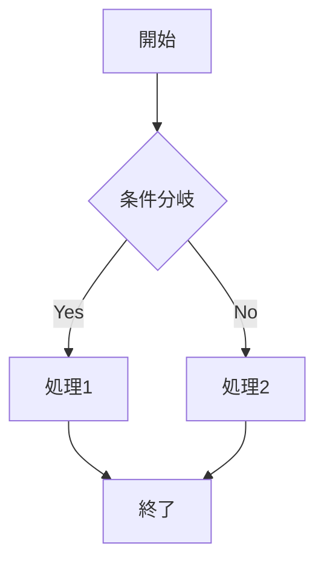
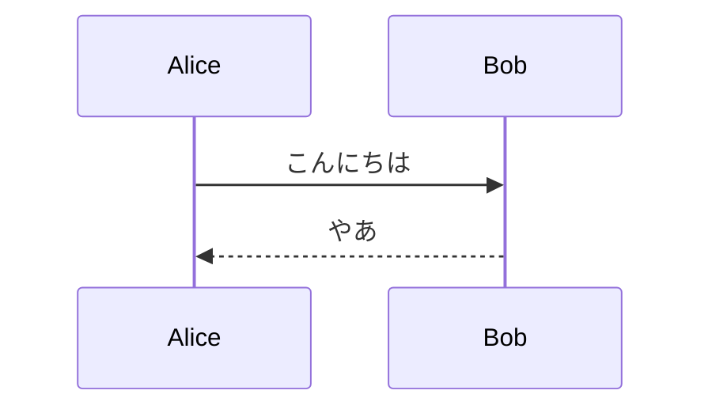

# mdvim v0.1

ブラウザで動作するVim風Markdownエディタです。インストール不要 - HTMLファイルを開くだけですぐに使えます。


## ✨ 機能

### 🎹 Vim操作

mdvimは効率的なテキスト編集のための包括的なVimキーバインドを実装しています。

#### モード
| モード | 入り方 | 説明 |
|--------|--------|------|
| **ノーマル** | `Esc` または `Ctrl+[` | ナビゲーションとコマンドのデフォルトモード |
| **挿入** | `i`, `a`, `o` など | テキスト入力モード |
| **ビジュアル** | `v` | 文字単位の選択 |
| **行ビジュアル** | `V` | 行単位の選択 |
| **コマンド** | `:` | Exコマンド（保存、開く、置換など） |

#### 移動コマンド
| キー | 動作 |
|------|------|
| `h` `j` `k` `l` | 左、下、上、右 |
| `w` / `b` | 次 / 前の単語 |
| `e` | 単語の末尾 |
| `0` / `$` | 行頭 / 行末 |
| `^` | 最初の非空白文字 |
| `gg` / `G` | ファイルの先頭 / 末尾 |
| `{数字}G` | 指定行へジャンプ |
| `{` / `}` | 前 / 次の段落 |
| `Ctrl+f` / `Ctrl+b` | 1ページ下 / 上 |
| `Ctrl+d` / `Ctrl+u` | 半ページ下 / 上 |
| `%` | 対応する括弧へジャンプ |

#### 行内検索
| キー | 動作 |
|------|------|
| `f{文字}` | 行内で次の{文字}を検索 |
| `F{文字}` | 行内で前の{文字}を検索 |
| `t{文字}` | 次の{文字}の手前まで |
| `T{文字}` | 前の{文字}の手前まで |
| `;` | 直前のf/F/t/Tを繰り返す |
| `,` | 直前のf/F/t/Tを逆方向に繰り返す |

#### 編集コマンド
| キー | 動作 |
|------|------|
| `x` / `X` | カーソル位置 / 手前の文字を削除 |
| `dd` | 行全体を削除 |
| `dw` | 単語を削除 |
| `d$` または `D` | 行末まで削除 |
| `d{モーション}` | モーションで指定した範囲を削除 |
| `cc` | 行全体を変更 |
| `cw` | 単語を変更 |
| `c$` または `C` | 行末まで変更 |
| `c{モーション}` | モーションで指定した範囲を変更 |
| `yy` または `Y` | 行全体をヤンク（コピー） |
| `yw` | 単語をヤンク |
| `y{モーション}` | モーションで指定した範囲をヤンク |
| `p` / `P` | カーソルの後 / 前に貼り付け |
| `u` | アンドゥ |
| `Ctrl+r` | リドゥ |
| `.` | 直前の編集を繰り返す |
| `~` | 大文字/小文字を切り替え |
| `J` | 行を結合 |
| `r{文字}` | 1文字置換 |
| `>>` / `<<` | インデント / アンインデント |

#### テキストオブジェクト
テキストオブジェクトで構造を正確に選択できます：

| キー | 動作 |
|------|------|
| `diw` / `daw` | 単語の内側/周囲を削除 |
| `ciw` / `caw` | 単語の内側/周囲を変更 |
| `yiw` / `yaw` | 単語の内側/周囲をヤンク |
| `di"` / `da"` | ダブルクォート内側/周囲を削除 |
| `di'` / `da'` | シングルクォート内側/周囲を削除 |
| `di(` / `da(` | 括弧内側/周囲を削除 |
| `di[` / `da[` | 角括弧内側/周囲を削除 |
| `di{` / `da{` | 波括弧内側/周囲を削除 |
| `` di` `` / `` da` `` | バッククォート内側/周囲を削除 |

#### マーク
| キー | 動作 |
|------|------|
| `m{a-z}` | 現在位置にマークを設定 |
| `'{a-z}` | マーク位置へジャンプ（行頭） |
| `` `{a-z} `` | マーク位置へジャンプ（正確な位置） |
| `''` | 直前の位置へ戻る |
| `:marks` | 全マークを表示 |

#### マクロ
| キー | 動作 |
|------|------|
| `q{a-z}` | マクロの記録開始 |
| `q` | 記録停止 |
| `@{a-z}` | マクロを再生 |
| `@@` | 直前のマクロを再生 |
| `{n}@{a-z}` | マクロをn回再生 |

#### 検索と置換
| コマンド | 動作 |
|----------|------|
| `/{パターン}` | 前方検索 |
| `n` / `N` | 次 / 前のマッチ |
| `*` | カーソル下の単語を検索 |
| `:s/old/new/` | 行内の最初を置換 |
| `:s/old/new/g` | 行内の全てを置換 |
| `:%s/old/new/g` | ファイル全体を置換 |
| `:{n},{m}s/old/new/g` | 範囲指定置換 |

---

### 📝 Markdownプレビュー

#### リアルタイムプレビュー
- 左にエディタ、右にプレビューの分割ビュー
- 入力に応じてプレビューが更新
- エディタとプレビューの同期スクロール

#### 目次（Table of Contents）
- 見出し（H1-H6）から自動生成
- クリックでセクションへ移動
- 折りたたみ可能なサイドバーパネル
- ドキュメント構造を一目で把握

#### 見出し折りたたみ
- プレビューの見出しをクリックで折りたたみ/展開
- 「全て折りたたむ」「全て展開」ボタン
- 同レベル以上の見出しまで折りたたみ

---

### 📊 拡張Markdown記法

#### テーブル
```markdown
| 左寄せ | 中央寄せ | 右寄せ |
|:-------|:--------:|-------:|
| L      |    C     |      R |
| 1      |    2     |      3 |
```

#### 数式（KaTeXによるLaTeX）

インライン数式：
```markdown
有名な式 $E = mc^2$ は物理学を変えました。
```

ブロック数式：
```markdown
$$
\int_{-\infty}^{\infty} e^{-x^2} dx = \sqrt{\pi}
$$
```

サポートする記法：
- 分数: `\frac{a}{b}`
- 平方根: `\sqrt{x}`, `\sqrt[n]{x}`
- 上付き/下付き: `x^2`, `x_i`, `x_{i,j}`
- ギリシャ文字: `\alpha`, `\beta`, `\gamma`, `\pi`, `\omega`
- 総和: `\sum_{i=0}^{n} x_i`
- 積分: `\int_{a}^{b} f(x) dx`
- 極限: `\lim_{x \to \infty}`
- 行列、ベクトルなど

#### Mermaid図

フローチャート：
````markdown

````

シーケンス図：
````markdown

````

その他サポートする図：
- `classDiagram` - クラス図
- `gantt` - ガントチャート
- `pie` - 円グラフ
- `erDiagram` - ER図
- `stateDiagram-v2` - 状態図

#### シンタックスハイライト

言語指定付きコードブロック：
````markdown
```javascript
function greet(name) {
  console.log(`Hello, ${name}!`);
}
```
````

highlight.jsにより180以上の言語をサポート。

#### タスクリスト
```markdown
- [x] 完了したタスク
- [ ] 未完了のタスク
- [x] もう一つの完了タスク
```

#### GitHub Alerts
```markdown
> [!NOTE]
> ユーザーが知っておくべき有用な情報。

> [!TIP]
> より良い方法についてのアドバイス。

> [!IMPORTANT]
> ユーザーが知る必要がある重要な情報。

> [!WARNING]
> すぐに注意が必要な緊急情報。

> [!CAUTION]
> リスクや否定的な結果についての注意。
```

#### Qiita Note記法
```markdown
:::note info
これは情報ノートです。
複数行をサポートします。
:::

:::note warn
これは警告ノートです。
:::

:::note alert
これはアラートノートです。
:::
```

#### 折りたたみセクション
```markdown
:::details クリックして展開
ここに隠れたコンテンツ。

- 内部で**Markdown**をサポート
- リストも使えます
:::
```

#### 絵文字ショートコード
```markdown
:smile: :rocket: :star: :+1: :heart:
:warning: :bulb: :memo: :fire: :tada:
```

結果: 😄 🚀 ⭐ 👍 ❤️ ⚠️ 💡 📝 🔥 🎉

#### URL自動リンク
URLは自動的にクリック可能なリンクに変換されます：
```markdown
詳細は https://example.com をご覧ください。
```

---

### 💾 ファイル操作

| コマンド | 動作 |
|----------|------|
| `:w` | 保存ダイアログを開く（File System Access API） |
| `:w filename.md` | 指定ファイル名でダウンロード |
| `:e` | ファイルを開くダイアログ |
| `:e!` | 強制的に開く（変更を破棄） |
| `:r` | カーソル位置にファイルを挿入 |
| `:new` | 新規ファイル |
| `:new!` | 強制的に新規ファイル（変更を破棄） |
| `:q` | 終了（未保存なら警告） |
| `:q!` | 強制終了（変更を破棄） |
| `:wq` | 保存して終了 |
| `:ls` | localStorageに保存 |

#### 自動保存
- 内容は毎秒sessionStorageに自動保存
- 各ブラウザタブは独立したストレージを持つ
- 明示的な`:w`でlocalStorageに保存（セッション間で永続）
- 新しいタブを開くと最後の`:w`内容が読み込まれる

---

### 🎨 UI機能

#### テーマ
3つのビルトインテーマ：
| テーマ | 説明 |
|--------|------|
| 🌙 ダーク | 暗い背景、目に優しい（デフォルト） |
| ☀️ ライト | 明るい背景、高コントラスト |
| 💻 オリジナル | CRT風レトロな緑黒 |

ツールバーボタンまたは`:theme dark|light|original`で変更

#### フォントサイズ
- ツールバーの**A-** / **A+**ボタン
- 範囲: 50% - 200%
- セッション間で保持

#### 表示モード
| モード | 説明 |
|--------|------|
| 編集 | エディタのみ |
| プレビュー | プレビューのみ |
| 分割 | 左右並列（デフォルト） |

#### ステータスバー
表示内容：
- 現在のファイル名
- 変更インジケータ（*）
- ヘルプヒント

#### モードインジケータ
表示内容：
- 現在のVimモード（NORMAL/INSERT/VISUAL/COMMAND）
- マクロ記録インジケータ（●REC）
- カーソル位置（行:列）

---

## 🚀 クイックスタート

1. **開く** `mdvim-jp.html`（日本語）または`mdvim.html`（英語）をブラウザで開く
2. **`i`を押す** 挿入モードに入る
3. **入力** Markdownコンテンツを入力
4. **`Esc`を押す** ノーマルモードに戻る
5. **`?`を押す** いつでもヘルプを表示
6. **`:w`と入力** 作業を保存

## 🌐 ブラウザサポート

| ブラウザ | サポート | 備考 |
|----------|----------|------|
| Chrome 86+ | ✅ 完全 | 推奨（File System Access API対応） |
| Edge 86+ | ✅ 完全 | 推奨（File System Access API対応） |
| Firefox | ✅ 良好 | 保存時はダウンロードにフォールバック |
| Safari | ✅ 良好 | 保存時はダウンロードにフォールバック |

## 📦 依存ライブラリ（CDN）

すべての依存関係はCDNから読み込み - ビルド不要：

| ライブラリ | バージョン | 用途 |
|------------|------------|------|
| [KaTeX](https://katex.org/) | 0.16.9 | LaTeX数式レンダリング |
| [Mermaid](https://mermaid.js.org/) | 10.x | 図表レンダリング |
| [highlight.js](https://highlightjs.org/) | 11.9.0 | シンタックスハイライト |

## 📁 ファイル構成

```
mdvim/
├── README.md           # 英語版ドキュメント
├── README-jp.md        # 日本語版ドキュメント
├── mdvim.html          # 英語版（単一ファイル、約140KB）
├── mdvim-jp.html       # 日本語版（単一ファイル、約140KB）
├── en/                 # 英語版（分割版）
│   ├── index.html      # メインHTML
│   ├── css/
│   │   └── style.css   # スタイル（約12KB）
│   └── js/
│       ├── app.js      # アプリ初期化（約2KB）
│       ├── markdown-parser.js  # MD→HTMLパーサー（約15KB）
│       └── vim-editor.js       # Vim実装（約90KB）
└── jp/                 # 日本語版（分割版）
    ├── index.html
    ├── css/
    │   └── style.css
    └── js/
        ├── app.js
        ├── markdown-parser.js
        └── vim-editor.js
```

### 単一ファイル vs 分割版

| バージョン | メリット | デメリット |
|------------|----------|------------|
| **単一ファイル** (`mdvim.html`) | 共有が簡単、オフラインで動作 | カスタマイズが難しい |
| **分割版** (`en/`, `jp/`) | 修正が簡単、整理された構成 | 複数ファイルの管理が必要 |

## ⌨️ キーバインド一覧

エディタで`?`を押すと完全なキーバインドヘルプが表示されます。

## 📄 ライセンス

MIT License

## 🙏 謝辞

- インスピレーションをくれたVim
- KaTeX、Mermaid、highlight.jsのチーム
- Markdownコミュニティ

---

**mdvim** - Vimの流儀でMarkdownを編集！ 🚀
