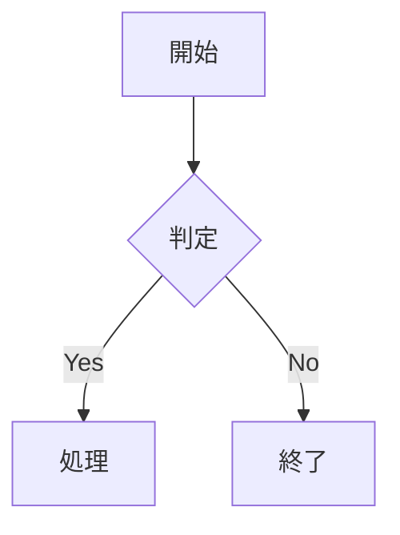

<p align="center">
  <h1 align="center">📝 mdvim</h1>
  <p align="center">
    <strong>ブラウザで動作するVim風マークダウンエディタ</strong>
  </p>
  <p align="center">
    <a href="#機能">機能</a> •
    <a href="#クイックスタート">クイックスタート</a> •
    <a href="#vimキーバインド">キーバインド</a> •
    <a href="#マークダウン対応">マークダウン</a> •
    <a href="#ライセンス">ライセンス</a>
  </p>
  <p align="center">
    
    
    
    
  </p>
</p>

---

ブラウザで完全に動作する高機能なVim風マークダウンエディタです。インストール不要、サーバー不要、ビルド不要 — HTMLファイルを開くだけで使えます。

## ✨ 機能

<table>
<tr>
<td width="50%">

### 🎹 Vimキーバインド
- フルモーダル編集（ノーマル、挿入、ビジュアル、コマンド）
- 移動コマンド（`hjkl`, `w`, `b`, `e`, `0`, `$`, `gg`, `G`）
- テキストオブジェクト（`diw`, `ci"`, `da(` など）
- オペレータ（`d`, `c`, `y`, `p`）
- マクロ（`q`, `@`）
- マーク（`m`, `'`）
- 検索・置換（`/`, `:%s`）

</td>
<td width="50%">

### 📝 リッチなマークダウン
- リアルタイムプレビュー（同期スクロール）
- **LaTeX数式**（KaTeX）
- **図表**（Mermaid）
- **シンタックスハイライト**（180言語以上）
- テーブル、タスクリスト、絵文字
- GitHubアラート & Qiitaノート
- 折りたたみセクション

</td>
</tr>
<tr>
<td>

### 🆕 NOVIMモード（v0.2）
- Vimバインディングなしの標準編集
- 馴染みのショートカット（`Ctrl+S`, `Ctrl+O` など）
- 矢印キー、Home/End、Page Up/Down
- Vim初心者に最適

</td>
<td>

### 🎨 カスタマイズ
- 3テーマ（ダーク、ライト、レトロCRT）
- フォントサイズ調整（50%-200%）
- 目次サイドバー
- 見出し折りたたみ
- 分割/編集/プレビュー表示モード

</td>
</tr>
</table>

## 🚀 クイックスタート

### 方法1: ダウンロードして開く
```bash
# リポジトリをクローン
git clone https://github.com/fukuyori/mdvim.git

# ブラウザで開く
open mdvim/mdvim-jp.html     # 日本語版
open mdvim/mdvim.html        # 英語版
```

### 方法2: 直接ダウンロード
1. `mdvim-jp.html`（または英語版 `mdvim.html`）をダウンロード
2. ブラウザで開く
3. 編集開始！

### 基本的な使い方

| 操作 | VIMモード | NOVIMモード |
|------|----------|------------|
| **編集開始** | `i` を押す | そのまま入力 |
| **保存** | `:w` と入力 | `Ctrl+S` |
| **ファイルを開く** | `:e` と入力 | `Ctrl+O` |
| **ヘルプ** | `?` を押す | `?` を押す |

## 🎹 Vimキーバインド

<details>
<summary><strong>📍 移動</strong></summary>

| キー | 動作 |
|-----|------|
| `h` `j` `k` `l` | 左、下、上、右 |
| `w` / `b` | 次/前の単語 |
| `e` | 単語末尾 |
| `0` / `$` | 行頭/行末 |
| `^` | 最初の非空白文字 |
| `gg` / `G` | ファイル先頭/末尾 |
| `{n}G` | n行目へ移動 |
| `{` / `}` | 前/次の段落 |
| `Ctrl+f` / `Ctrl+b` | ページダウン/アップ |
| `Ctrl+d` / `Ctrl+u` | 半ページダウン/アップ |
| `%` | 対応する括弧 |
| `f{c}` / `F{c}` | 文字を前方/後方検索 |
| `t{c}` / `T{c}` | 文字の手前まで前方/後方移動 |

</details>

<details>
<summary><strong>✏️ 編集</strong></summary>

| キー | 動作 |
|-----|------|
| `i` / `a` | カーソル前/後に挿入 |
| `I` / `A` | 行頭/行末に挿入 |
| `o` / `O` | 下/上に新しい行 |
| `x` / `X` | カーソル下/前の文字を削除 |
| `dd` | 行削除 |
| `dw` / `d$` / `D` | 単語/行末まで削除 |
| `cc` / `C` | 行/行末まで変更 |
| `cw` | 単語変更 |
| `yy` / `Y` | 行コピー |
| `p` / `P` | 後/前に貼り付け |
| `u` / `Ctrl+r` | アンドゥ/リドゥ |
| `.` | 直前の編集を繰り返し |
| `~` | 大文字/小文字切替 |
| `J` | 行結合 |
| `r{c}` | 一文字置換 |
| `>>` / `<<` | インデント/アンインデント |

</details>

<details>
<summary><strong>🎯 テキストオブジェクト</strong></summary>

`d`（削除）、`c`（変更）、`y`（コピー）、`v`（選択）と組み合わせて使用：

| キー | 動作 |
|-----|------|
| `iw` / `aw` | 単語内/周囲 |
| `i"` / `a"` | ダブルクォート内/周囲 |
| `i'` / `a'` | シングルクォート内/周囲 |
| `i(` / `a(` | 括弧内/周囲 |
| `i[` / `a[` | 角括弧内/周囲 |
| `i{` / `a{` | 波括弧内/周囲 |
| `` i` `` / `` a` `` | バッククォート内/周囲 |

**例:** `diw`（単語削除）、`ci"`（引用符内を変更）、`ya(`（括弧周囲をコピー）

</details>

<details>
<summary><strong>🔍 検索・置換</strong></summary>

| コマンド | 動作 |
|---------|------|
| `/{パターン}` | 前方検索 |
| `n` / `N` | 次/前のマッチ |
| `*` | カーソル下の単語を検索 |
| `:s/old/new/` | 行内で最初を置換 |
| `:s/old/new/g` | 行内で全て置換 |
| `:%s/old/new/g` | ファイル全体で置換 |
| `:{n},{m}s/old/new/g` | 範囲内で置換 |

</details>

<details>
<summary><strong>📌 マーク & マクロ</strong></summary>

| キー | 動作 |
|-----|------|
| `m{a-z}` | マークを設定 |
| `'{a-z}` | マークへ移動（行頭） |
| `` `{a-z} `` | マークへ移動（正確な位置） |
| `''` | 前の位置へ戻る |
| `q{a-z}` | マクロ記録開始 |
| `q` | 記録停止 |
| `@{a-z}` | マクロ再生 |
| `@@` | 直前のマクロを再生 |
| `{n}@{a-z}` | マクロをn回再生 |

</details>

<details>
<summary><strong>💾 ファイルコマンド</strong></summary>

| コマンド | 動作 |
|---------|------|
| `:w` | 保存（File System API またはダウンロード） |
| `:w {名前}` | ファイル名を指定して保存 |
| `:e` | ファイル選択ダイアログを開く |
| `:e {名前}` | ファイルを開く/作成 |
| `:r` | カーソル位置にファイルを挿入 |
| `:new` | 新規ファイル |
| `:q` | 終了（未保存なら警告） |
| `:q!` | 強制終了 |
| `:wq` | 保存して終了 |

</details>

<details>
<summary><strong>⚙️ 設定コマンド</strong></summary>

| コマンド | 動作 |
|---------|------|
| `:set vim` | VIMモードを有効化 |
| `:set novim` | NOVIMモードに切り替え |
| `:set nu` | 行番号を表示 |
| `:set nonu` | 行番号を非表示 |
| `:set theme=dark` | ダークテーマに変更 |
| `:set theme=light` | ライトテーマに変更 |
| `:set theme=original` | レトロCRTテーマに変更 |
| `:set autosave` | 現在の自動保存設定を表示 |
| `:set autosave=off` | 自動保存を無効化 |
| `:set autosave=1s` | 1秒間隔（デフォルト） |
| `:set autosave=5s` | 5秒間隔 |
| `:set autosave=10s` | 10秒間隔 |
| `:set autosave=30s` | 30秒間隔 |
| `:set autosave=60s` | 60秒間隔 |

</details>

## 📊 マークダウン対応

### 標準マークダウン
見出し、太字、斜体、リンク、画像、リスト、引用、コードブロック、水平線

### 拡張機能

<details>
<summary><strong>📐 数式（KaTeX）</strong></summary>

インライン: `$E = mc^2$` → $E = mc^2$

ブロック:
```latex
$$
\int_{-\infty}^{\infty} e^{-x^2} dx = \sqrt{\pi}
$$
```

</details>

<details>
<summary><strong>📊 図表（Mermaid）</strong></summary>

````markdown

````

対応: フローチャート、シーケンス図、クラス図、状態遷移図、ER図、ガントチャート、円グラフ

</details>

<details>
<summary><strong>💻 コード（highlight.js）</strong></summary>

````markdown
```javascript
function hello(name) {
  console.log(`Hello, ${name}!`);
}
```
````

180言語以上対応

</details>

<details>
<summary><strong>📋 その他の機能</strong></summary>

**テーブル:**
```markdown
| 左寄せ | 中央 | 右寄せ |
|:------|:----:|------:|
| A     |  B   |     C |
```

**タスクリスト:**
```markdown
- [x] 完了
- [ ] 未完了
```

**GitHubアラート:**
```markdown
> [!NOTE]
> 情報

> [!WARNING]
> 警告メッセージ
```

**絵文字:** `:smile:` → 😄, `:rocket:` → 🚀

**折りたたみ:**
```markdown
:::details クリックで展開
隠れた内容
:::
```

</details>

## 🎨 テーマ

| テーマ | 説明 |
|-------|------|
| 🌙 **ダーク** | ダーク背景（デフォルト） |
| ☀️ **ライト** | ライト背景 |
| 💻 **オリジナル** | レトロCRT風グリーン |

ツールバーまたは `:theme dark|light|original` で変更

## 🌐 対応ブラウザ

| ブラウザ | 状態 | 備考 |
|---------|------|------|
| Chrome 86+ | ✅ フル | 推奨（File System Access API） |
| Edge 86+ | ✅ フル | 推奨 |
| Firefox | ✅ 良好 | 保存はダウンロードで代替 |
| Safari | ✅ 良好 | 保存はダウンロードで代替 |

## 📁 プロジェクト構成

```
mdvim/
├── mdvim.html          # 英語版（単一ファイル、約145KB）
├── mdvim-jp.html       # 日本語版（単一ファイル、約145KB）
├── README.md           # 英語ドキュメント
├── README-jp.md        # 日本語ドキュメント
├── en/                 # 英語版（モジュラー）
│   ├── index.html
│   ├── css/style.css
│   └── js/
│       ├── app.js
│       ├── vim-editor.js
│       └── markdown-parser.js
└── jp/                 # 日本語版（モジュラー）
    └── ...
```

### 単一ファイル vs モジュラー

| バージョン | 用途 |
|-----------|------|
| **単一ファイル** | 共有しやすい、オフライン使用、USBで持ち運び |
| **モジュラー** | 開発、カスタマイズ |

## 📦 依存ライブラリ

すべてCDNから読み込み（ビルド不要）:

- [KaTeX](https://katex.org/) v0.16.9 — LaTeX描画
- [Mermaid](https://mermaid.js.org/) v10.x — 図表描画
- [highlight.js](https://highlightjs.org/) v11.9.0 — シンタックスハイライト

## 📝 更新履歴

### v0.5.5
- 🔧 ファイル保存をVim準拠に改善
- ✨ ドラッグ&ドロップ・PWAでファイルハンドル保持（上書き保存対応）
- ✨ Ctrl+S で上書き保存、Ctrl+A で別名保存ダイアログ
- ✨ :w filename で別名保存（ファイルハンドル更新）
- ✨ :wq は上書き保存、:x は変更時のみ保存
- ✨ PWAでは :q/:wq/:x でアプリ終了
- 🗑️ :saveas コマンドを削除（:w filename に統合）

### v0.5.4
- ⚡ 大量データ（1000行以上）のパフォーマンス改善
- ⚡ 行番号の仮想スクロール対応
- ⚡ デバウンス処理の最適化

### v0.5.3
- ✨ ヤンク操作のみクリップボードにコピー（削除はコピーしない）
- ✨ "*y でクリップボードにヤンク、"*p でクリップボードからペースト

### v0.5.2
- 🐛 setRegister関数の無限再帰バグを修正
- ✨ ヤンク・削除時にクリップボードへ自動コピー

### v0.5.1
- 🔧 英語版・分割版に新機能を適用
- 📝 全ドキュメントを更新

### v0.5
- ✨ 名前付きレジスタ（"a〜"z）
- ✨ マーク機能（ma, `a, 'a）の保存・復元
- ✨ マクロの自動保存・読み込み
- 新コマンド: :reg, :marks, :macros, :delmarks, :delmacro

### v0.4.2
- 🐛 Service Workerのchrome-extensionエラーを修正
- 🐛 非推奨のmetaタグを更新

### v0.4
- ✨ PWA対応（オフライン使用可能、アプリとしてインストール可能）
- ✨ ファイル関連付け（.md, .txt ファイルを mdvim で開く）
- ✨ ドラッグ＆ドロップでファイルを開く
- 🐛 プレビューペインの表示問題を修正

### v0.3.6
- 🐛 フォントサイズ拡大時のプレビュー表示領域の問題を修正

### v0.3.5
- 🐛 Dコマンド（行末まで削除）後のカーソル位置を修正
- 🐛 分割版の構文エラーを修正

### v0.3.3
- 🚀 パフォーマンス改善：エディタ内の見出しハイライトを廃止

### v0.3.2
- 🐛 起動時のビューモードボタンのハイライト状態を修正

### v0.3.1
- ✨ 長い行での横スクロール追従（カーソルが常に表示範囲内に）

### v0.3
- ✨ オートインデント機能（Enter押下時にリストマーカー・インデントを継承）
- ✨ リスト行でTabキーによる階層変更（Tab: 深く、Shift+Tab: 浅く）
- 🚀 パフォーマンス改善（重い処理にデバウンス処理を追加）
- 🐛 ビジュアルラインモード（V）でj/kが正しく1行ずつ移動するように修正

### v0.2.5
- ✨ 箇条書きの階層表示（ネストされたリスト）をサポート
- ✨ ヤンク（`yy`, `yw`など）でシステムクリップボードにコピー
- ✨ カーソル移動時に画面が自動スクロール
- ✨ 自動保存間隔を設定可能に（`:set autosave=off|1s|5s|10s|30s|60s`）
- 🔧 新規タブ起動時に最新セッションを現在のセッションにコピー
- 🐛 ビジュアルモードで後方選択（`j`, `l`など）が正しく動作するように修正
- 🐛 行番号とテキストの位置ずれを修正
- 🐛 見出しハイライトの位置ずれを修正
- 🐛 ファイルを開いた際に目次が更新されない問題を修正

### v0.2.4
- ✨ `Ctrl+\``でVIM/NOVIMモード切り替え
- 🔧 NOVIMモードで`:`と`?`が通常入力可能に
- 🐛 `:welcome`で目次・プレビューが更新されない問題を修正

### v0.2.3
- ✨ `z`コマンドによる画面スクロール追加（`zt`, `zz`, `zb`, `z Enter`, `z.`, `z-`）
- ✨ `:welcome`コマンドでウェルカム画面を表示
- 🐛 1行目の先頭で`x`キーを押した際のフォーカス消失を修正
- 🐛 空行や1行のみのドキュメントで`dd`が動作しない問題を修正
- 🔧 削除操作後のカーソル位置・表示を改善

### v0.2.1
- 🔧 複数タブでのセッション管理を改善
- 💾 セッションごとのlocalStorage自動保存
- 🧹 古いセッションの自動クリーンアップ（7日以上）
- 📁 セッション間でファイル名を保持

### v0.2
- ✨ 標準編集用のNOVIMモードを追加
- ⌨️ NOVIMモードでのショートカット追加（Ctrl+O/S/A/N）
- 🐛 ファイル読み込み時の目次自動更新を修正
- 🎨 カーソル表示とモード切替を改善
- 💬 ステータスメッセージ表示を追加

### v0.1
- 🎉 初回リリース
- Vimキーバインドのフルサポート
- 数式、図表、シンタックスハイライト付きマークダウンプレビュー

## 🤝 コントリビューション

コントリビューションは大歓迎です！お気軽にプルリクエストを送ってください。

1. リポジトリをフォーク
2. フィーチャーブランチを作成（`git checkout -b feature/AmazingFeature`）
3. 変更をコミット（`git commit -m 'Add some AmazingFeature'`）
4. ブランチにプッシュ（`git push origin feature/AmazingFeature`）
5. プルリクエストを開く

## 📄 ライセンス

このプロジェクトはMITライセンスの下で公開されています。詳細は[LICENSE](LICENSE)ファイルを参照してください。

## 🙏 謝辞

- インスピレーションを与えてくれた[Vim](https://www.vim.org/)
- [KaTeX](https://katex.org/)、[Mermaid](https://mermaid.js.org/)、[highlight.js](https://highlightjs.org/)チーム

---

<p align="center">
  <strong>mdvim</strong> — VimスタイルでMarkdownを編集！ 🚀
</p>
