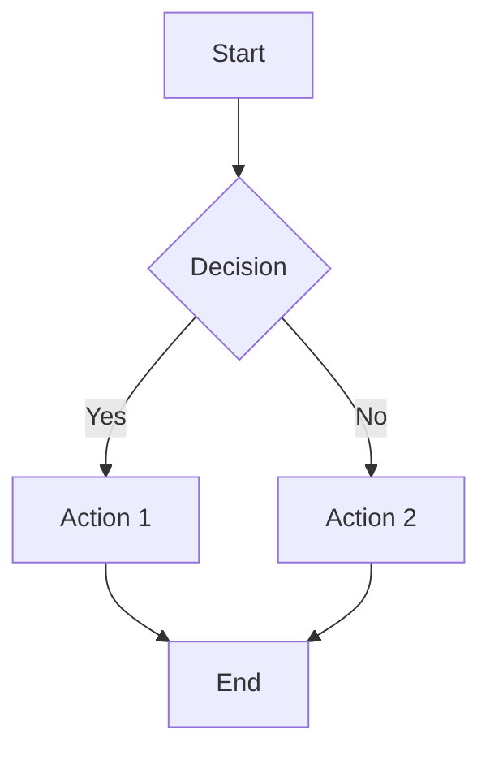
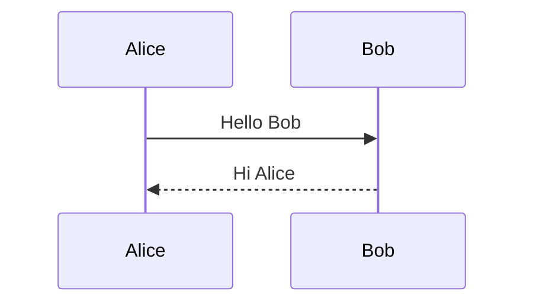

# mdvim v0.1

A powerful Vim-style Markdown editor running entirely in the browser. No installation required - just open the HTML file and start editing.


## ✨ Features

### 🎹 Vim Operations

mdvim implements a comprehensive subset of Vim keybindings for efficient text editing.

#### Modes
| Mode | How to Enter | Description |
|------|--------------|-------------|
| **Normal** | `Esc` or `Ctrl+[` | Default mode for navigation and commands |
| **Insert** | `i`, `a`, `o`, etc. | Text input mode |
| **Visual** | `v` | Character-wise selection |
| **Visual Line** | `V` | Line-wise selection |
| **Command** | `:` | Ex commands (save, open, replace, etc.) |

#### Movement Commands
| Key | Action |
|-----|--------|
| `h` `j` `k` `l` | Left, Down, Up, Right |
| `w` / `b` | Next / Previous word |
| `e` | End of word |
| `0` / `$` | Beginning / End of line |
| `^` | First non-whitespace character |
| `gg` / `G` | Beginning / End of file |
| `{number}G` | Go to line number |
| `{` / `}` | Previous / Next paragraph |
| `Ctrl+f` / `Ctrl+b` | Page down / Page up |
| `Ctrl+d` / `Ctrl+u` | Half page down / Half page up |
| `%` | Jump to matching bracket |

#### In-line Search
| Key | Action |
|-----|--------|
| `f{char}` | Find next {char} in line |
| `F{char}` | Find previous {char} in line |
| `t{char}` | Till next {char} (cursor before) |
| `T{char}` | Till previous {char} |
| `;` | Repeat last f/F/t/T |
| `,` | Repeat last f/F/t/T in reverse |

#### Editing Commands
| Key | Action |
|-----|--------|
| `x` / `X` | Delete character under / before cursor |
| `dd` | Delete entire line |
| `dw` | Delete word |
| `d$` or `D` | Delete to end of line |
| `d{motion}` | Delete with motion |
| `cc` | Change entire line |
| `cw` | Change word |
| `c$` or `C` | Change to end of line |
| `c{motion}` | Change with motion |
| `yy` or `Y` | Yank (copy) entire line |
| `yw` | Yank word |
| `y{motion}` | Yank with motion |
| `p` / `P` | Paste after / before cursor |
| `u` | Undo |
| `Ctrl+r` | Redo |
| `.` | Repeat last edit |
| `~` | Toggle case of character |
| `J` | Join lines |
| `r{char}` | Replace single character |
| `>>` / `<<` | Indent / Unindent line |

#### Text Objects
Text objects allow precise selection of text structures:

| Key | Action |
|-----|--------|
| `diw` / `daw` | Delete inner/around word |
| `ciw` / `caw` | Change inner/around word |
| `yiw` / `yaw` | Yank inner/around word |
| `di"` / `da"` | Delete inner/around double quotes |
| `di'` / `da'` | Delete inner/around single quotes |
| `di(` / `da(` | Delete inner/around parentheses |
| `di[` / `da[` | Delete inner/around brackets |
| `di{` / `da{` | Delete inner/around braces |
| `` di` `` / `` da` `` | Delete inner/around backticks |

#### Marks
| Key | Action |
|-----|--------|
| `m{a-z}` | Set mark at current position |
| `'{a-z}` | Jump to mark (line beginning) |
| `` `{a-z} `` | Jump to mark (exact position) |
| `''` | Jump to previous position |
| `:marks` | List all marks |

#### Macros
| Key | Action |
|-----|--------|
| `q{a-z}` | Start recording macro |
| `q` | Stop recording |
| `@{a-z}` | Play macro |
| `@@` | Replay last macro |
| `{n}@{a-z}` | Play macro n times |

#### Search and Replace
| Command | Action |
|---------|--------|
| `/{pattern}` | Search forward |
| `n` / `N` | Next / Previous match |
| `*` | Search word under cursor |
| `:s/old/new/` | Replace first in line |
| `:s/old/new/g` | Replace all in line |
| `:%s/old/new/g` | Replace all in file |
| `:{n},{m}s/old/new/g` | Replace in line range |

---

### 📝 Markdown Preview

#### Real-time Preview
- Split view with editor on left, preview on right
- Preview updates as you type
- Synchronized scrolling between editor and preview

#### Table of Contents
- Auto-generated from headings (H1-H6)
- Click to navigate to section
- Collapsible sidebar panel
- Shows document structure at a glance

#### Heading Fold
- Click any heading in preview to fold/unfold its content
- "Collapse All" / "Expand All" buttons
- Folds content until next heading of same or higher level

---

### 📊 Extended Markdown Syntax

#### Tables
```markdown
| Left | Center | Right |
|:-----|:------:|------:|
| L    |   C    |     R |
| 1    |   2    |     3 |
```

#### Math (LaTeX via KaTeX)

Inline math:
```markdown
The equation $E = mc^2$ changed physics.
```

Block math:
```markdown
$$
\int_{-\infty}^{\infty} e^{-x^2} dx = \sqrt{\pi}
$$
```

Supported notation:
- Fractions: `\frac{a}{b}`
- Square roots: `\sqrt{x}`, `\sqrt[n]{x}`
- Superscripts/subscripts: `x^2`, `x_i`, `x_{i,j}`
- Greek letters: `\alpha`, `\beta`, `\gamma`, `\pi`, `\omega`
- Summation: `\sum_{i=0}^{n} x_i`
- Integration: `\int_{a}^{b} f(x) dx`
- Limits: `\lim_{x \to \infty}`
- Matrices, vectors, and more

#### Mermaid Diagrams

Flowchart:
````markdown

````

Sequence Diagram:
````markdown

````

Other supported diagrams:
- `classDiagram` - Class diagrams
- `gantt` - Gantt charts
- `pie` - Pie charts
- `erDiagram` - ER diagrams
- `stateDiagram-v2` - State diagrams

#### Syntax Highlighting

Code blocks with language specification:
````markdown
```javascript
function greet(name) {
  console.log(`Hello, ${name}!`);
}
```
````

Supports 180+ languages via highlight.js.

#### Task Lists
```markdown
- [x] Completed task
- [ ] Pending task
- [x] Another done task
```

#### GitHub Alerts
```markdown
> [!NOTE]
> Useful information that users should know.

> [!TIP]
> Helpful advice for doing things better.

> [!IMPORTANT]
> Key information users need to know.

> [!WARNING]
> Urgent info that needs immediate attention.

> [!CAUTION]
> Advises about risks or negative outcomes.
```

#### Qiita Note Syntax
```markdown
:::note info
This is an information note.
Supports multiple lines.
:::

:::note warn
This is a warning note.
:::

:::note alert
This is an alert note.
:::
```

#### Collapsible Sections
```markdown
:::details Click to expand
Hidden content here.

- Supports **Markdown** inside
- Lists work too
:::
```

#### Emoji Shortcodes
```markdown
:smile: :rocket: :star: :+1: :heart:
:warning: :bulb: :memo: :fire: :tada:
```

Result: 😄 🚀 ⭐ 👍 ❤️ ⚠️ 💡 📝 🔥 🎉

#### Auto-linking URLs
URLs are automatically converted to clickable links:
```markdown
Check out https://example.com for more info.
```

---

### 💾 File Operations

| Command | Action |
|---------|--------|
| `:w` | Open save dialog (File System Access API) |
| `:w filename.md` | Download with specified filename |
| `:e` | Open file dialog |
| `:e!` | Force open (discard changes) |
| `:r` | Insert file at cursor position |
| `:new` | Create new file |
| `:new!` | Force new file (discard changes) |
| `:q` | Quit (warns if unsaved) |
| `:q!` | Force quit (discard changes) |
| `:wq` | Save and quit |
| `:ls` | Save to localStorage |

#### Auto-save
- Content auto-saves to sessionStorage every second
- Each browser tab has independent storage
- Explicit `:w` saves to localStorage (persists across sessions)
- Last `:w` content loads when opening new tabs

---

### 🎨 UI Features

#### Themes
Three built-in themes:
| Theme | Description |
|-------|-------------|
| 🌙 Dark | Dark background, easy on eyes (default) |
| ☀️ Light | Light background, high contrast |
| 💻 Original | CRT-style retro green-on-black |

Change via toolbar buttons or `:theme dark|light|original`

#### Font Size
- **A-** / **A+** buttons in toolbar
- Range: 50% - 200%
- Persists across sessions

#### View Modes
| Mode | Description |
|------|-------------|
| Edit | Editor only |
| Preview | Preview only |
| Split | Side-by-side (default) |

#### Status Bar
Shows:
- Current filename
- Modified indicator (*)
- Help hint

#### Mode Indicator
Shows:
- Current Vim mode (NORMAL/INSERT/VISUAL/COMMAND)
- Macro recording indicator (●REC)
- Cursor position (line:column)

---

## 🚀 Quick Start

1. **Open** `mdvim.html` (English) or `mdvim-jp.html` (Japanese) in your browser
2. **Press `i`** to enter insert mode
3. **Type** your Markdown content
4. **Press `Esc`** to return to normal mode
5. **Press `?`** for help at any time
6. **Type `:w`** to save your work

## 🌐 Browser Support

| Browser | Support | Notes |
|---------|---------|-------|
| Chrome 86+ | ✅ Full | Recommended (File System Access API) |
| Edge 86+ | ✅ Full | Recommended (File System Access API) |
| Firefox | ✅ Good | Falls back to download for save |
| Safari | ✅ Good | Falls back to download for save |

## 📦 Dependencies (CDN)

All dependencies are loaded from CDN - no build step required:

| Library | Version | Purpose |
|---------|---------|---------|
| [KaTeX](https://katex.org/) | 0.16.9 | LaTeX math rendering |
| [Mermaid](https://mermaid.js.org/) | 10.x | Diagram rendering |
| [highlight.js](https://highlightjs.org/) | 11.9.0 | Syntax highlighting |

## 📁 File Structure

```
mdvim/
├── README.md           # English documentation
├── README-jp.md        # Japanese documentation
├── mdvim.html          # English version (single file, ~140KB)
├── mdvim-jp.html       # Japanese version (single file, ~140KB)
├── en/                 # English version (modular)
│   ├── index.html      # Main HTML
│   ├── css/
│   │   └── style.css   # Styles (~12KB)
│   └── js/
│       ├── app.js      # App initialization (~2KB)
│       ├── markdown-parser.js  # MD→HTML parser (~15KB)
│       └── vim-editor.js       # Vim implementation (~90KB)
└── jp/                 # Japanese version (modular)
    ├── index.html
    ├── css/
    │   └── style.css
    └── js/
        ├── app.js
        ├── markdown-parser.js
        └── vim-editor.js
```

### Single File vs Modular

| Version | Pros | Cons |
|---------|------|------|
| **Single file** (`mdvim.html`) | Easy to share, works offline | Harder to customize |
| **Modular** (`en/`, `jp/`) | Easy to modify, better organization | Multiple files to manage |

## ⌨️ Complete Keybinding Reference

Press `?` in the editor to see the full keybinding help.

## 📄 License

MIT License

## 🙏 Acknowledgments

- Vim for the inspiration
- KaTeX, Mermaid, and highlight.js teams
- The Markdown community

---

**mdvim** - Edit Markdown the Vim way! 🚀
