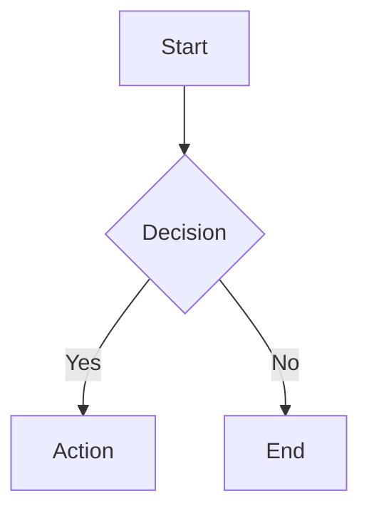

<p align="center">
  <h1 align="center">📝 mdvim</h1>
  <p align="center">
    <strong>Vim-style Markdown Editor in the Browser</strong>
  </p>
  <p align="center">
    <a href="#features">Features</a> •
    <a href="#quick-start">Quick Start</a> •
    <a href="#vim-keybindings">Keybindings</a> •
    <a href="#markdown-support">Markdown</a> •
    <a href="#license">License</a>
  </p>
  <p align="center">
    
    
    
    
  </p>
</p>

---

A powerful, fully-featured Vim-style Markdown editor that runs entirely in your browser. No installation, no server, no build step required — just open the HTML file and start editing.

## ✨ Features

<table>
<tr>
<td width="50%">

### 🎹 Vim Keybindings
- Full modal editing (Normal, Insert, Visual, Command)
- Motion commands (`hjkl`, `w`, `b`, `e`, `0`, `$`, `gg`, `G`)
- Text objects (`diw`, `ci"`, `da(`, etc.)
- Operators (`d`, `c`, `y`, `p`)
- Macros (`q`, `@`)
- Marks (`m`, `'`)
- Search & Replace (`/`, `:%s`)

</td>
<td width="50%">

### 📝 Rich Markdown
- Real-time preview with sync scroll
- **LaTeX math** via KaTeX
- **Diagrams** via Mermaid
- **Syntax highlighting** (180+ languages)
- Tables, task lists, emoji
- GitHub Alerts & Qiita notes
- Collapsible sections

</td>
</tr>
<tr>
<td>

### 🆕 NOVIM Mode (v0.2)
- Standard editing without Vim bindings
- Familiar shortcuts (`Ctrl+S`, `Ctrl+O`, etc.)
- Arrow keys, Home/End, Page Up/Down
- Perfect for Vim beginners

</td>
<td>

### 🎨 Customization
- 3 themes (Dark, Light, Retro CRT)
- Adjustable font size (50%-200%)
- Table of Contents sidebar
- Heading fold/unfold
- Split/Edit/Preview modes

</td>
</tr>
</table>

## 🚀 Quick Start

### Option 1: Download and Open
```bash
# Clone the repository
git clone https://github.com/fukuyori/mdvim.git

# Open in browser
open mdvim/mdvim.html        # English
open mdvim/mdvim-jp.html     # Japanese
```

### Option 2: Direct Download
1. Download `mdvim.html` (or `mdvim-jp.html` for Japanese)
2. Open in your browser
3. Start editing!

### Basic Usage

| Mode | VIM Mode | NOVIM Mode |
|------|----------|------------|
| **Start editing** | Press `i` | Just type |
| **Save** | Type `:w` | Press `Ctrl+S` |
| **Open file** | Type `:e` | Press `Ctrl+O` |
| **Help** | Press `?` | Press `?` |

## 🎹 Vim Keybindings

<details>
<summary><strong>📍 Movement</strong></summary>

| Key | Action |
|-----|--------|
| `h` `j` `k` `l` | Left, Down, Up, Right |
| `w` / `b` | Next / Previous word |
| `e` | End of word |
| `0` / `$` | Start / End of line |
| `^` | First non-blank character |
| `gg` / `G` | Start / End of file |
| `{n}G` | Go to line n |
| `{` / `}` | Previous / Next paragraph |
| `Ctrl+f` / `Ctrl+b` | Page Down / Up |
| `Ctrl+d` / `Ctrl+u` | Half Page Down / Up |
| `%` | Matching bracket |
| `f{c}` / `F{c}` | Find char forward / backward |
| `t{c}` / `T{c}` | Till char forward / backward |

</details>

<details>
<summary><strong>✏️ Editing</strong></summary>

| Key | Action |
|-----|--------|
| `i` / `a` | Insert before / after cursor |
| `I` / `A` | Insert at line start / end |
| `o` / `O` | New line below / above |
| `x` / `X` | Delete char under / before cursor |
| `dd` | Delete line |
| `dw` / `d$` / `D` | Delete word / to end of line |
| `cc` / `C` | Change line / to end of line |
| `cw` | Change word |
| `yy` / `Y` | Yank (copy) line |
| `p` / `P` | Paste after / before |
| `u` / `Ctrl+r` | Undo / Redo |
| `.` | Repeat last edit |
| `~` | Toggle case |
| `J` | Join lines |
| `r{c}` | Replace with char |
| `>>` / `<<` | Indent / Unindent |

</details>

<details>
<summary><strong>🎯 Text Objects</strong></summary>

Use with `d` (delete), `c` (change), `y` (yank), or `v` (visual):

| Key | Action |
|-----|--------|
| `iw` / `aw` | Inner / Around word |
| `i"` / `a"` | Inner / Around double quotes |
| `i'` / `a'` | Inner / Around single quotes |
| `i(` / `a(` | Inner / Around parentheses |
| `i[` / `a[` | Inner / Around brackets |
| `i{` / `a{` | Inner / Around braces |
| `` i` `` / `` a` `` | Inner / Around backticks |

**Examples:** `diw` (delete word), `ci"` (change inside quotes), `ya(` (yank around parens)

</details>

<details>
<summary><strong>🔍 Search & Replace</strong></summary>

| Command | Action |
|---------|--------|
| `/{pattern}` | Search forward |
| `n` / `N` | Next / Previous match |
| `*` | Search word under cursor |
| `:s/old/new/` | Replace first in line |
| `:s/old/new/g` | Replace all in line |
| `:%s/old/new/g` | Replace all in file |
| `:{n},{m}s/old/new/g` | Replace in range |

</details>

<details>
<summary><strong>📌 Marks & Macros</strong></summary>

| Key | Action |
|-----|--------|
| `m{a-z}` | Set mark |
| `'{a-z}` | Jump to mark (line) |
| `` `{a-z} `` | Jump to mark (exact) |
| `''` | Jump to previous position |
| `q{a-z}` | Start recording macro |
| `q` | Stop recording |
| `@{a-z}` | Play macro |
| `@@` | Replay last macro |
| `{n}@{a-z}` | Play macro n times |

</details>

<details>
<summary><strong>💾 File Commands</strong></summary>

| Command | Action |
|---------|--------|
| `:w` | Save (File System API or download) |
| `:w {name}` | Save with filename |
| `:e` | Open file dialog |
| `:e {name}` | Open/create file |
| `:r` | Insert file at cursor |
| `:new` | New file |
| `:q` | Quit (warns if unsaved) |
| `:q!` | Force quit |
| `:wq` | Save and quit |

</details>

<details>
<summary><strong>⚙️ Settings Commands</strong></summary>

| Command | Action |
|---------|--------|
| `:set vim` | Enable VIM mode |
| `:set novim` | Switch to NOVIM mode |
| `:set nu` | Show line numbers |
| `:set nonu` | Hide line numbers |
| `:set theme=dark` | Dark theme |
| `:set theme=light` | Light theme |
| `:set theme=original` | Retro CRT theme |
| `:set autosave` | Show current auto-save setting |
| `:set autosave=off` | Disable auto-save |
| `:set autosave=1s` | 1 second interval (default) |
| `:set autosave=5s` | 5 second interval |
| `:set autosave=10s` | 10 second interval |
| `:set autosave=30s` | 30 second interval |
| `:set autosave=60s` | 60 second interval |

</details>

## 📊 Markdown Support

### Standard Markdown
Headers, bold, italic, links, images, lists, blockquotes, code blocks, horizontal rules

### Extended Features

<details>
<summary><strong>📐 Math (KaTeX)</strong></summary>

Inline: `$E = mc^2$` → $E = mc^2$

Block:
```latex
$$
\int_{-\infty}^{\infty} e^{-x^2} dx = \sqrt{\pi}
$$
```

</details>

<details>
<summary><strong>📊 Diagrams (Mermaid)</strong></summary>

````markdown

````

Supports: flowchart, sequence, class, state, ER, gantt, pie charts

</details>

<details>
<summary><strong>💻 Code (highlight.js)</strong></summary>

````markdown
```javascript
function hello(name) {
  console.log(`Hello, ${name}!`);
}
```
````

180+ languages supported

</details>

<details>
<summary><strong>📋 Other Features</strong></summary>

**Tables:**
```markdown
| Left | Center | Right |
|:-----|:------:|------:|
| A    |   B    |     C |
```

**Task Lists:**
```markdown
- [x] Completed
- [ ] Pending
```

**GitHub Alerts:**
```markdown
> [!NOTE]
> Information

> [!WARNING]
> Warning message
```

**Emoji:** `:smile:` → 😄, `:rocket:` → 🚀

**Collapsible:**
```markdown
:::details Click to expand
Hidden content
:::
```

</details>

## 🎨 Themes

| Theme | Description |
|-------|-------------|
| 🌙 **Dark** | Dark background (default) |
| ☀️ **Light** | Light background |
| 💻 **Original** | Retro CRT green-on-black |

Change via toolbar or `:theme dark|light|original`

## 🌐 Browser Support

| Browser | Status | Notes |
|---------|--------|-------|
| Chrome 86+ | ✅ Full | Recommended (File System Access API) |
| Edge 86+ | ✅ Full | Recommended |
| Firefox | ✅ Good | Download fallback for save |
| Safari | ✅ Good | Download fallback for save |

## 📁 Project Structure

```
mdvim/
├── mdvim.html          # English (single file, ~145KB)
├── mdvim-jp.html       # Japanese (single file, ~145KB)
├── README.md           # English documentation
├── README-jp.md        # Japanese documentation
├── en/                 # English (modular)
│   ├── index.html
│   ├── css/style.css
│   └── js/
│       ├── app.js
│       ├── vim-editor.js
│       └── markdown-parser.js
└── jp/                 # Japanese (modular)
    └── ...
```

### Single File vs Modular

| Version | Use Case |
|---------|----------|
| **Single file** | Easy sharing, offline use, USB portable |
| **Modular** | Development, customization |

## 📦 Dependencies

All loaded via CDN (no build required):

- [KaTeX](https://katex.org/) v0.16.9 — LaTeX rendering
- [Mermaid](https://mermaid.js.org/) v10.x — Diagrams
- [highlight.js](https://highlightjs.org/) v11.9.0 — Syntax highlighting

## 📝 Changelog

### v0.2.5
- ✨ Added nested list support (indented bullet/numbered lists)
- ✨ Yank commands (`yy`, `yw`, etc.) now copy to system clipboard
- ✨ Auto-scroll on cursor movement
- ✨ Configurable auto-save interval (`:set autosave=off|1s|5s|10s|30s|60s`)
- 🔧 Copy latest session to current session on new tab launch
- 🐛 Fixed visual mode backward selection (`j`, `l`, etc.)
- 🐛 Fixed line number and text position misalignment
- 🐛 Fixed heading highlight position misalignment
- 🐛 Fixed TOC not updating when opening files

### v0.2.4
- ✨ Added `Ctrl+`` to toggle VIM/NOVIM mode
- 🔧 NOVIM mode: `:` and `?` now input normally as text
- 🐛 Fixed `:welcome` not updating TOC and preview

### v0.2.3
- ✨ Added `z` commands for screen scrolling (`zt`, `zz`, `zb`, `z Enter`, `z.`, `z-`)
- ✨ Added `:welcome` command to display welcome screen
- 🐛 Fixed focus loss when pressing `x` at beginning of first line
- 🐛 Fixed `dd` not working on empty lines or single-line documents
- 🔧 Improved cursor position and display after delete operations

### v0.2.1
- 🔧 Improved multi-tab session support
- 💾 Per-session auto-save to localStorage
- 🧹 Auto-cleanup of old sessions (7+ days)
- 📁 Filename preserved across sessions

### v0.2
- ✨ Added NOVIM mode for standard editing
- ⌨️ Added shortcuts in NOVIM mode (Ctrl+O/S/A/N)
- 🐛 Fixed TOC auto-update on file open
- 🎨 Improved cursor display and mode switching
- 💬 Added status message display

### v0.1
- 🎉 Initial release
- Full Vim keybinding support
- Markdown preview with math, diagrams, syntax highlighting

## 🤝 Contributing

Contributions are welcome! Please feel free to submit a Pull Request.

1. Fork the repository
2. Create your feature branch (`git checkout -b feature/AmazingFeature`)
3. Commit your changes (`git commit -m 'Add some AmazingFeature'`)
4. Push to the branch (`git push origin feature/AmazingFeature`)
5. Open a Pull Request

## 📄 License

This project is licensed under the MIT License - see the [LICENSE](LICENSE) file for details.

## 🙏 Acknowledgments

- [Vim](https://www.vim.org/) for the inspiration
- [KaTeX](https://katex.org/), [Mermaid](https://mermaid.js.org/), [highlight.js](https://highlightjs.org/) teams

---

<p align="center">
  <strong>mdvim</strong> — Edit Markdown the Vim way! 🚀
</p>
