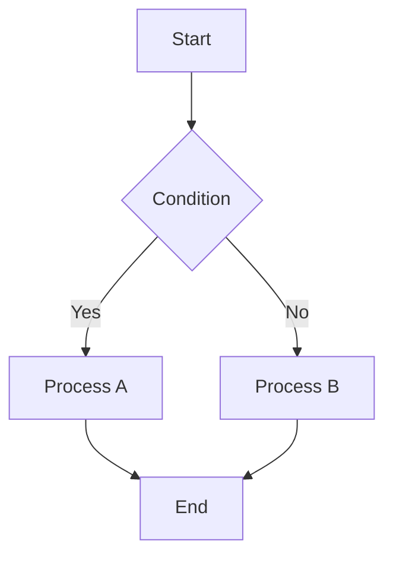

# "mdvim" — A Vim-style Markdown Editor That Runs Entirely in Your Browser

## Introduction

What editor do you use when writing documents in Markdown? VS Code, Obsidian, Typora... there are many options, but for Vimmers, finding an editor with "properly working Vim keybindings" is surprisingly difficult.

VS Code's Vim extension is convenient, but it's not quite a complete Vim experience. On the other hand, if you launch Vim in the terminal to write Markdown, you can't see a preview. Obsidian has a vim mode, but... Many of you might share these frustrations.

That's why I developed "mdvim" — a Vim-style Markdown editor that runs entirely in your browser. No installation required, no server needed. Just open the HTML file and start editing in Vim style immediately.

In this article, I'll explain mdvim's features and how to use it in detail.

---

## Getting Started with mdvim

### Download and Launch

Getting started with mdvim is very easy.

**Method 1: Download from GitHub**

```bash
git clone https://github.com/yourusername/mdvim.git
cd mdvim
```

After cloning, just open `mdvim.html` (English version) or `mdvim-jp.html` (Japanese version) in your browser.

**Method 2: Direct HTML File Download**

Download `mdvim.html` from the GitHub Releases page and double-click to open it.

Either way, once you see the editor screen in your browser, you're ready to go. On first launch, a welcome document explaining how to use the editor will be displayed.

### Screen Layout

The mdvim screen is divided into four main areas.

**Header (Top)**
- Logo and version display
- Filename display (click to change)
- Toolbar (font size adjustment, theme switching, view mode switching)
- VIM/NOVIM mode toggle button

**Table of Contents Panel (Left Sidebar)**
- List of headings in the document
- Click to jump to that section
- Double-click to fold/unfold

**Editor (Center Left)**
- Text area for editing Markdown
- Vim mode display (NORMAL/INSERT/VISUAL/COMMAND)
- Cursor position display

**Preview (Center Right)**
- Real-time rendered Markdown
- Scroll sync with editor

### Recommended Browsers

mdvim works on all major modern browsers, but for the best experience, we recommend Chrome 86+ or Edge 86+. These browsers support the File System Access API, allowing you to directly overwrite local files.

Firefox and Safari work fine too, but saving will be done via download.

---

## mdvim Features

### 1. Full-Featured Vim Keybindings

mdvim is not just "hjkl movement" level. It fully supports modal editing (Normal/Insert/Visual/Command modes) and covers most everyday Vim operations.

**Main supported features:**
- Motions (hjkl, w, b, e, 0, $, gg, G, %, etc.)
- Operators (d, c, y, p)
- Text objects (iw, aw, i", a", i(, a(, etc.)
- Visual mode (v, V)
- Macro recording/playback (q, @)
- Marks (m, ')
- Search/Replace (/, n, N, :s, :%s)
- Undo/Redo (u, Ctrl+r)
- Repeat (.)
- Registers

If you're familiar with Vim, you should be able to start using it without any discomfort.

### 2. Rich Markdown Preview

A real-time preview is displayed next to the editor. Scrolling is synchronized, so you can always see where you're editing even in long documents.

In addition to standard Markdown syntax, the following extensions are supported:

**Math (KaTeX)**
Inline math `$E=mc^2$` and block math `$$...$$` are beautifully rendered. Useful for writing papers and technical documents.

**Diagrams (Mermaid)**
Generate flowcharts, sequence diagrams, class diagrams, ER diagrams, Gantt charts, pie charts, and more from text. Great for adding diagrams to design documents and READMEs.

**Syntax Highlighting (highlight.js)**
Supports 180+ languages. Code blocks are displayed with clear highlighting.

**Other Extensions**
- Tables (GFM format)
- Task lists (`- [x]`, `- [ ]`)
- GitHub Alerts (`> [!NOTE]`, `> [!WARNING]`, etc.)
- Qiita notation (`:::note info`, etc.)
- Emoji (`:smile:` → 😄)
- Collapsible sections (`:::details`)

### 3. NOVIM Mode

A new feature added in v0.2. For those who "don't know Vim but want to use this editor's features," we've provided a mode that works like a standard text editor.

In NOVIM mode:
- Arrow keys for cursor movement
- Shift+Arrow for selection
- Ctrl+Z/Y for undo/redo
- Ctrl+S (save)
- Ctrl+O (open)
- Ctrl+N (new)
- Ctrl+A (save as)

All standard editor operations work. Toggle between VIM/NOVIM with one click using the button on screen. It's also perfect for Vim beginners to gradually learn Vim operations.

### 4. Complete Offline Operation

mdvim is contained in a single HTML file. Required CSS and JavaScript are embedded in the file, and external libraries (KaTeX, Mermaid, highlight.js) are loaded from CDN.

Once the page is loaded, it works offline afterward. You can continue writing on airplanes or in areas without signal. You can even carry it on a USB drive.

### 5. Auto-save and Session Management

Content being edited is automatically saved to browser localStorage every second. Even if you close the browser, you can resume editing from where you left off on the next launch.

---

## Using VIM Mode

For those who have never used Vim, I'll explain the basic operations. If you're already familiar with Vim, feel free to skip this section.

### The Concept of Modes

Vim's biggest feature is the concept of "modes." mdvim has four modes.

**Normal Mode**
The mode when you first start. You enter cursor movement and text operation commands. You cannot directly input text in this mode.

**Insert Mode**
The mode for actually inputting text. You can type characters just like in a regular editor.

**Visual Mode**
The mode for selecting text. You can perform operations on the selected range.

**Command Mode**
The mode for entering commands starting with `:`. Used for saving and file operations.

### Basic Workflow

1. **Launch** → Start in Normal mode
2. **Press `i`** → Enter Insert mode
3. **Type your text**
4. **Press `Escape`** → Return to Normal mode
5. **Move cursor and press `i` again to enter Insert mode**
6. **Type `:w`** → Save the file

This "Normal mode ↔ Insert mode" switching is the foundation of Vim.

### Cursor Movement

In Normal mode, use these keys for cursor movement:

| Key | Action |
|-----|--------|
| `h` | Move left |
| `j` | Move down |
| `k` | Move up |
| `l` | Move right |
| `w` | Next word beginning |
| `b` | Previous word beginning |
| `e` | End of word |
| `0` | Beginning of line |
| `$` | End of line |
| `gg` | Beginning of file |
| `G` | End of file |
| `10G` | Go to line 10 |

Arrow keys also work, but once you get used to hjkl (which you can use without moving your hands from home position), your editing efficiency will dramatically improve.

### Entering Insert Mode

| Key | Action |
|-----|--------|
| `i` | Insert before cursor |
| `a` | Insert after cursor |
| `I` | Insert at beginning of line |
| `A` | Insert at end of line |
| `o` | Create new line below and insert |
| `O` | Create new line above and insert |

Using these appropriately saves cursor movement effort.

### Editing Text

Commands for editing text in Normal mode:

| Key | Action |
|-----|--------|
| `x` | Delete character at cursor |
| `dd` | Delete (cut) line |
| `dw` | Delete word |
| `d$` or `D` | Delete from cursor to end of line |
| `cc` | Delete line and enter Insert mode |
| `cw` | Delete word and enter Insert mode |
| `yy` | Copy (yank) line |
| `yw` | Copy word |
| `p` | Paste after cursor |
| `P` | Paste before cursor |
| `u` | Undo |
| `Ctrl+r` | Redo |
| `.` | Repeat last edit |

Deleted content is automatically saved to a register, so you can paste with `p`. This works like "cut & paste."

### Text Objects

One of Vim's powerful features is text objects. Use them with `d` (delete), `c` (change), or `y` (yank).

| Command | Action |
|---------|--------|
| `diw` | Delete word (inner word) |
| `daw` | Delete word and surrounding whitespace (a word) |
| `di"` | Delete inside double quotes |
| `da"` | Delete including double quotes |
| `di(` | Delete inside parentheses |
| `da(` | Delete including parentheses |
| `di{` | Delete inside braces |
| `ci"` | Change inside double quotes |
| `yi(` | Copy inside parentheses |

For example, if your cursor is inside the text `"Hello, World!"`, typing `ci"` will delete the content inside the quotes and enter Insert mode. Type new text and press `Escape` to replace just the content inside the quotes.

### Search and Replace

**Search**

| Command | Action |
|---------|--------|
| `/pattern` | Search forward |
| `n` | Next match |
| `N` | Previous match |
| `*` | Search word under cursor |

**Replace**

| Command | Action |
|---------|--------|
| `:s/old/new/` | Replace first old with new in current line |
| `:s/old/new/g` | Replace all old with new in current line |
| `:%s/old/new/g` | Replace all in file |
| `:10,20s/old/new/g` | Replace in lines 10-20 |

### Macros

A powerful feature for automating repetitive tasks.

1. `qa` to start recording macro (records to register a)
2. Execute a series of operations
3. `q` to stop recording
4. `@a` to play macro
5. `10@a` to repeat 10 times

For example, to add `- ` at the beginning of each line to make a list:

1. `qa` to start recording
2. Type `I- <Escape>j` (insert `- ` at line beginning and move to next line)
3. `q` to stop recording
4. `99@a` to apply to remaining lines

### Marks

Remember positions in the document and jump back to them later.

| Command | Action |
|---------|--------|
| `ma` | Record current position as mark a |
| `'a` | Jump to mark a's line |
| `` `a `` | Jump to mark a's exact position |
| `''` | Return to previous position |

Useful for marking places you want to reference when editing long documents.

---

## Using Command Mode

Press `:` to enter Command mode. A command input field appears at the bottom of the screen.

### File Operations

| Command | Action |
|---------|--------|
| `:w` | Save (overwrites in File System API-compatible browsers) |
| `:w filename.md` | Save with filename |
| `:e` | Open file dialog |
| `:e filename.md` | Open/create specified file |
| `:r` | Insert file at cursor position |
| `:new` | New file |
| `:q` | Quit (warns if unsaved changes) |
| `:q!` | Force quit (discard changes) |
| `:wq` | Save and quit |

### Display Settings

| Command | Action |
|---------|--------|
| `:theme dark` | Switch to dark theme |
| `:theme light` | Switch to light theme |
| `:theme original` | Switch to retro CRT theme |
| `:fontsize 120` | Set font size to 120% |
| `:set number` | Show line numbers |
| `:set nonumber` | Hide line numbers |

### Other Commands

| Command | Action |
|---------|--------|
| `:help` | Show help |
| `:10` | Jump to line 10 |

---

## Using NOVIM Mode

For those unfamiliar with VIM mode, or who want to use it as a regular editor, please use NOVIM mode.

### Switching Modes

Click the "VIM" button in the upper right of the text input area to switch modes. Settings are saved in the browser, so it will start in the same mode next time.

### Keyboard Operations

In NOVIM mode, standard text editor operations work.

**Cursor Movement**
- Arrow keys: Move up/down/left/right
- `Home` / `End`: Move to beginning/end of line
- `Ctrl+Home` / `Ctrl+End`: Move to beginning/end of file
- `Page Up` / `Page Down`: Move by page

**Selection**
- `Shift+Arrow keys`: Extend selection
- `Ctrl+A`: Select all (however, in mdvim this is assigned to "Save As")

**Editing**
- `Ctrl+Z`: Undo
- `Ctrl+Y`: Redo
- `Ctrl+C`: Copy
- `Ctrl+X`: Cut
- `Ctrl+V`: Paste
- `Tab`: Indent

**File Operations**
- `Ctrl+S`: Save
- `Ctrl+O`: Open file
- `Ctrl+N`: New file
- `Ctrl+A`: Save as

**Other**
- `?`: Show help
- `:`: Enter Command mode (VIM commands work)

Commands like `:w` and `:theme` work in NOVIM mode too.

---

## Useful Features

### Table of Contents Panel

The left sidebar automatically displays headings (#, ##, ###, etc.) from the document.

- Click a heading to jump to that section
- Double-click a heading to fold/unfold the text under that heading in the editor
- Toggle the TOC panel visibility with the "≡" button in the upper left

Useful for working while understanding the document structure when editing long documents.

### View Mode Switching

Switch view modes with the "Split," "Edit," and "Preview" buttons in the toolbar.

- **Split**: Display editor and preview side by side (default)
- **Edit**: Display only the editor (when you want to focus on writing)
- **Preview**: Display only the preview (when you want to check the final result)

### Themes

Three themes are available.

- **Dark**: Eye-friendly dark theme (default)
- **Light**: Light theme suitable for bright environments
- **Original**: Retro CRT-style green theme

Switch via the toolbar dropdown or commands like `:theme dark`.

### Font Size

Adjust font size with the "A-" "A+" buttons in the toolbar, or the `:fontsize 120` command. Adjustable from 50% to 200%. Settings are saved in the browser.

### Scroll Sync

When you scroll the editor, the preview scrolls in sync. This lets you always know where in the preview corresponds to where you're editing.

---

## Markdown Syntax Guide

Here's a summary of Markdown syntax available in mdvim.

### Basic Syntax

```markdown
# Heading 1
## Heading 2
### Heading 3

**bold** *italic* ~~strikethrough~~

[Link](https://example.com)


- List item
- List item
  - Nested list

1. Numbered list
2. Numbered list

> Blockquote

`inline code`

Horizontal rule
---
```

### Code Blocks

Specify the language name for syntax highlighting.

````markdown
```javascript
function hello(name) {
  console.log(`Hello, ${name}!`);
}
```
````

### Tables

```markdown
| Left | Center | Right |
|:-----|:------:|------:|
| A    |   B    |     C |
| D    |   E    |     F |
```

### Task Lists

```markdown
- [x] Completed task
- [ ] Incomplete task
```

### Math (KaTeX)

```markdown
Inline math: $E = mc^2$

Block math:
$$
\int_{-\infty}^{\infty} e^{-x^2} dx = \sqrt{\pi}
$$
```

### Diagrams (Mermaid)

````markdown

````

You can draw various diagrams including flowcharts, sequence diagrams, class diagrams, ER diagrams, Gantt charts, and pie charts.

### GitHub Alerts

```markdown
> [!NOTE]
> Supplementary information.

> [!TIP]
> Helpful hint.

> [!IMPORTANT]
> Important information.

> [!WARNING]
> Warning.

> [!CAUTION]
> Caution required.
```

### Qiita Notation

```markdown
:::note info
Information
:::

:::note warn
Warning
:::

:::note alert
Alert
:::
```

### Collapsible

```markdown
:::details Click to expand
Hidden content goes here.
:::
```

### Emoji

Enter emoji using `:emoji_name:` format.

```markdown
:smile: :rocket: :star: :+1: :heart:
```

---

## Tips & Techniques

### Tips for Efficient Editing

**1. Use the Dot Command**

The `.` (dot) key repeats the last edit. For example:
- After changing a word with `ciw`, pressing `.` on another word applies the same change
- After deleting a line with `dd`, `.` deletes the next line too

**2. Boost Efficiency with Text Objects**

When editing content inside quotes or parentheses, you don't need to move the cursor manually:
- `ci"`: Change inside double quotes
- `di(`: Delete inside parentheses
- `yi{`: Copy inside braces

**3. Range Selection with Visual Mode**

Press `v` to enter Visual mode, use movement keys to select a range, then press `d` (delete) or `y` (copy).
`V` for line-wise selection is also available.

**4. Jump with Search**

Search with `/keyword` to jump to the keyword location. `n` for next match, `N` for previous match.
Press `*` to instantly search for the word under the cursor.

### Keyboard-Only Operation

mdvim is designed to work entirely with the keyboard.

- File operations: `:w`, `:e`, `:new`
- Theme change: `:theme dark`
- Font size: `:fontsize 120`
- Line jump: `:100` to go to line 100
- Help: `?` or `:help`

You can work without using the mouse, helping you focus on writing.

### Tips for Editing CJK Text

When editing Japanese/Chinese/Korean text, word movement with `w` or `b` doesn't work as well as in English. These methods are more useful:

- `f` + character: Jump to that character (`f。` to next "。")
- `/` + word: Jump via search
- `0` and `$`: Jump to beginning/end of line
- `{` and `}`: Move by paragraph

---

## FAQ

### Q. I've never used Vim. Can I still use it?

A. Yes, using NOVIM mode lets you operate it like a regular editor. Switch to NOVIM mode using the button in the upper right. Once you get comfortable, trying VIM mode is recommended.

### Q. Where are files saved?

A. In Chrome or Edge, saving with `:w` saves as a local file (a file save dialog appears the first time). Once saved, the file is overwritten to the same location next time. In Firefox or Safari, it's saved as a download.

### Q. Where is auto-save stored?

A. In the browser's localStorage. It's restored on next launch even if you close the browser. However, it's lost if you clear browser data, so save important documents as files with `:w`.

### Q. Does it work offline?

A. Yes, once the page is loaded, it works offline. However, math (KaTeX), diagrams (Mermaid), and syntax highlighting (highlight.js) are loaded from CDN, so an online environment is needed for the first load.

### Q. Can I open files created in other Markdown editors?

A. Yes, standard Markdown files (.md, .markdown) can be opened as-is. Open the file selection dialog with `:e` and select the file.

### Q. Can I print?

A. Yes, use the browser's print function (Ctrl+P) to print the preview display. Switching to "Preview" mode before printing will print only the preview.

### Q. Does it work on smartphones or tablets?

A. It works, but Vim keybindings are designed for physical keyboards, so it's not suited for touch operation. With an external keyboard, it works comfortably.

---

## Technical Details

mdvim is built with pure HTML/CSS/JavaScript. No frameworks like React, Vue, or Angular are used.

The following external libraries are used (all loaded from CDN):

- **KaTeX** v0.16.9: LaTeX math rendering
- **Mermaid** v10.x: Diagram generation
- **highlight.js** v11.9.0: Code syntax highlighting

Core features (Vim keybinding handling, Markdown parser, preview scroll sync, etc.) are all implemented from scratch. The single-file version is about 5000 lines and approximately 150KB.

### File Saving Mechanism

In Chrome 86+ and Edge 86+, the File System Access API is used to directly read and write local files. You can overwrite files opened with `:w` directly, which is very convenient.

In unsupported browsers (Firefox, Safari), it falls back to creating a Blob and generating a download link.

### Auto-save Mechanism

Edited content is auto-saved to localStorage. In v0.2.1, we improved the system to issue independent session IDs for each tab and save session data individually.

```javascript
// Session data structure
{
  content: "# Document content...",
  filename: "document.md",
  timestamp: 1703123456789
}
```

Old sessions (no access for 7+ days) are automatically cleaned up at startup.

---

## Conclusion

mdvim was developed with the goal of being "a simple yet powerful Markdown editor for Vimmers."

Main features summarized:

- Runs in browser only, no installation required
- Full-featured Vim keybindings
- NOVIM mode for Vim beginners
- Rich preview with KaTeX, Mermaid, and highlight.js
- Auto-save and multi-tab support
- Complete offline operation

It should be useful for a wide range of purposes, from personal writing to creating technical documentation and drafting blog posts.

The source code is available on GitHub. Bug reports, feature requests, and pull requests are welcome.

Please give it a try. Happy Vimming! 🚀
