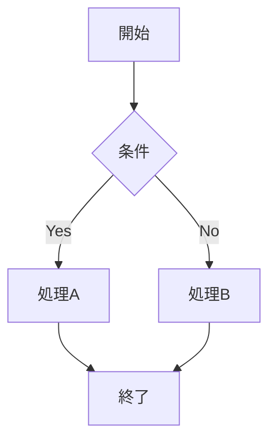

# ブラウザだけで動くVim風マークダウンエディタ「mdvim」を作った

## はじめに

マークダウンでドキュメントを書くとき、どんなエディタを使っていますか？VS Code、Obsidian、Typora……選択肢は数多くありますが、Vimmerにとって「Vimキーバインドがちゃんと使える」エディタは意外と少ないものです。

VS CodeのVim拡張は便利ですが、完全なVim体験とは言えません。かといってターミナルでVimを立ち上げてマークダウンを書くと、プレビューが見られない。Obsidianにもvim modeはあるが...といった悩みを抱えている方も多いのではないでしょうか。

そこで、ブラウザ上で完全に動作するVim風マークダウンエディタ「mdvim」を開発しました。インストール不要、サーバー不要。HTMLファイルを開くだけで、すぐにVimスタイルの編集が始められます。

この記事では、mdvimの特徴から具体的な使い方まで、詳しく解説していきます。

---

## mdvimを始める

### ダウンロードと起動

mdvimを使い始めるのはとても簡単です。

**方法1：GitHubからダウンロード**

```bash
git clone https://github.com/fukuyori/mdvim.git
cd mdvim
```

クローンしたら、`mdvim-jp.html`（日本語版）または`mdvim.html`（英語版）をブラウザで開くだけです。

**方法2：HTMLファイルを直接ダウンロード**

GitHubのReleasesページから`mdvim-jp.html`をダウンロードして、ダブルクリックで開きます。

どちらの方法でも、ブラウザにエディタ画面が表示されれば準備完了です。初回起動時には、使い方を説明するウェルカムドキュメントが表示されます。

### 画面構成

mdvimの画面は大きく4つのエリアに分かれています。

**ヘッダー（上部）**
- ロゴとバージョン表示
- ファイル名表示（クリックで変更可能）
- ツールバー（フォントサイズ調整、テーマ切り替え、表示モード切り替え）
- VIM/NOVIMモード切り替えボタン

**目次パネル（左サイドバー）**
- ドキュメント内の見出し一覧
- クリックで該当箇所にジャンプ
- ダブルクリックで折りたたみ/展開

**エディタ（中央左）**
- マークダウンを編集するテキストエリア
- Vimのモード表示（NORMAL/INSERT/VISUAL/COMMAND）
- カーソル位置表示

**プレビュー（中央右）**
- リアルタイムでレンダリングされたマークダウン
- エディタとスクロール同期

### 推奨ブラウザ

mdvimは主要なモダンブラウザで動作しますが、最高の体験を得るにはChrome 86以降またはEdge 86以降をお勧めします。これらのブラウザではFile System Access APIが使え、ローカルファイルを直接上書き保存できます。

FirefoxやSafariでも問題なく使えますが、保存時はダウンロードによる保存になります。

---

## mdvimの特徴

### 1. 本格的なVimキーバインド

mdvimは単なる「hjkl移動ができる」レベルではありません。モーダル編集（ノーマル/挿入/ビジュアル/コマンドモード）を完全サポートし、日常的なVim操作のほとんどをカバーしています。

**対応している主な機能：**
- モーション（hjkl、w、b、e、0、$、gg、G、%など）
- オペレータ（d、c、y、p）
- テキストオブジェクト（iw、aw、i"、a"、i(、a(など）
- ビジュアルモード（v、V）
- マクロ記録・再生（q、@）
- マーク（m、'）
- 検索・置換（/、n、N、:s、:%s）
- アンドゥ・リドゥ（u、Ctrl+r）
- 繰り返し（.）
- レジスタ

Vimに慣れた方なら、違和感なく使い始められるはずです。

### 2. リッチなマークダウンプレビュー

編集画面の横にリアルタイムプレビューを表示。スクロールも同期するので、長いドキュメントでも今どこを編集しているか一目でわかります。

標準的なマークダウン記法に加えて、以下の拡張機能をサポートしています。

**数式（KaTeX）**
インライン数式 `$E=mc^2$` やブロック数式 `$$...$$` をきれいにレンダリング。論文やテクニカルドキュメントの執筆に便利です。

**図表（Mermaid）**
フローチャート、シーケンス図、クラス図、ER図、ガントチャート、円グラフなどをテキストから生成。設計ドキュメントやREADMEに図を入れたいときに重宝します。

**シンタックスハイライト（highlight.js）**
180以上の言語に対応。コードブロックが見やすく表示されます。

**その他の拡張**
- テーブル（GFM形式）
- タスクリスト（`- [x]`、`- [ ]`）
- GitHubアラート（`> [!NOTE]`、`> [!WARNING]`など）
- Qiita記法（`:::note info`など）
- 絵文字（`:smile:` → 😄）
- 折りたたみセクション（`:::details`）

### 3. NOVIMモード搭載

v0.2で追加した新機能です。「Vimは使えないけど、このエディタの機能は使いたい」という方のために、通常のテキストエディタとして使えるモードを用意しました。

NOVIMモードでは矢印キーでカーソル移動、Shift+矢印で範囲選択、Ctrl+Z/Yでアンドゥ/リドゥなど、一般的なエディタと同じ操作が可能です。Ctrl+S（保存）、Ctrl+O（開く）、Ctrl+N（新規）、Ctrl+A（名前を付けて保存）といったショートカットも使えます。

画面右上のボタンでVIM/NOVIMをワンクリック切り替え。Vim初心者が少しずつVim操作を覚えていく練習用としても最適です。

### 4. 完全オフライン動作

mdvimは単一のHTMLファイルで完結しています。必要なCSS、JavaScriptはファイル内に埋め込まれ、外部ライブラリ（KaTeX、Mermaid、highlight.js）はCDNから読み込みます。

一度ページを読み込めば、その後はオフラインでも動作します。飛行機の中や電波の届かない場所でも執筆を続けられます。USBメモリに入れて持ち歩くこともできます。

### 5. 自動保存とセッション管理

編集中の内容は1秒ごとにブラウザのlocalStorageに自動保存されます。ブラウザを閉じても、次回起動時に続きから編集を再開できます。

v0.2.1では複数タブ対応を強化しました。タブAでファイルA、タブBでファイルBを編集していても、それぞれ独立して保存・復元されます。7日以上アクセスのない古いセッションは自動的にクリーンアップされるため、ストレージを圧迫する心配もありません。

---

## VIMモードの使い方

Vimを使ったことがない方のために、基本的な操作方法を説明します。すでにVimに慣れている方は、この章を飛ばしていただいても構いません。

### モードの概念

Vimの最大の特徴は「モード」の概念です。mdvimには4つのモードがあります。

**ノーマルモード**
起動直後のモード。カーソル移動やテキスト操作のコマンドを入力します。このモードでは文字を直接入力できません。

**挿入モード**
実際にテキストを入力するモード。一般的なエディタと同じように文字が入力できます。

**ビジュアルモード**
テキストを選択するモード。選択した範囲に対して操作を行えます。

**コマンドモード**
`:` で始まるコマンドを入力するモード。保存やファイル操作などを行います。

### 基本的なワークフロー

1. **起動** → ノーマルモードでスタート
2. **`i` を押す** → 挿入モードに入る
3. **テキストを入力する**
4. **`Escape` を押す** → ノーマルモードに戻る
5. **カーソルを移動して、また `i` で挿入モードへ**
6. **`:w` と入力** → ファイルを保存

この「ノーマルモード ↔ 挿入モード」の切り替えがVimの基本です。

### カーソル移動

ノーマルモードでのカーソル移動は以下のキーを使います。

| キー | 動作 |
|------|------|
| `h` | 左へ移動 |
| `j` | 下へ移動 |
| `k` | 上へ移動 |
| `l` | 右へ移動 |
| `w` | 次の単語の先頭へ |
| `b` | 前の単語の先頭へ |
| `e` | 単語の末尾へ |
| `0` | 行頭へ |
| `$` | 行末へ |
| `gg` | ファイルの先頭へ |
| `G` | ファイルの末尾へ |
| `10G` | 10行目へ |

矢印キーでも移動できますが、ホームポジションから手を動かさずに操作できるhjklに慣れると、編集効率が大幅に上がります。

### 挿入モードへの入り方

| キー | 動作 |
|------|------|
| `i` | カーソル位置の前に挿入 |
| `a` | カーソル位置の後に挿入 |
| `I` | 行頭に挿入 |
| `A` | 行末に挿入 |
| `o` | 下に新しい行を作って挿入 |
| `O` | 上に新しい行を作って挿入 |

状況に応じて使い分けると、カーソル移動の手間が省けます。

### テキストの編集

ノーマルモードでテキストを編集するコマンドです。

| キー | 動作 |
|------|------|
| `x` | カーソル位置の文字を削除 |
| `dd` | 行を削除（カット） |
| `dw` | 単語を削除 |
| `d$` または `D` | カーソルから行末まで削除 |
| `cc` | 行を削除して挿入モードへ |
| `cw` | 単語を削除して挿入モードへ |
| `yy` | 行をコピー（ヤンク） |
| `yw` | 単語をコピー |
| `p` | カーソルの後にペースト |
| `P` | カーソルの前にペースト |
| `u` | アンドゥ |
| `Ctrl+r` | リドゥ |
| `.` | 直前の編集を繰り返し |

削除した内容は自動的にレジスタに保存されるので、`p` でペーストできます。これは「カット＆ペースト」と同じ動作になります。

### テキストオブジェクト

Vimの強力な機能の一つがテキストオブジェクトです。`d`（削除）、`c`（変更）、`y`（コピー）と組み合わせて使います。

| コマンド | 動作 |
|----------|------|
| `diw` | 単語を削除（inner word） |
| `daw` | 単語と周囲の空白を削除（a word） |
| `di"` | ダブルクォート内を削除 |
| `da"` | ダブルクォートごと削除 |
| `di(` | 括弧内を削除 |
| `da(` | 括弧ごと削除 |
| `di{` | 波括弧内を削除 |
| `ci"` | ダブルクォート内を変更 |
| `yi(` | 括弧内をコピー |

例えば、`"Hello, World!"` というテキストの中にカーソルがあるとき、`ci"` と入力すると引用符の中身が削除されて挿入モードになります。新しいテキストを入力して `Escape` を押せば、引用符内だけを置き換えられます。

### 検索と置換

**検索**

| コマンド | 動作 |
|----------|------|
| `/pattern` | 前方検索 |
| `n` | 次のマッチへ |
| `N` | 前のマッチへ |
| `*` | カーソル下の単語を検索 |

**置換**

| コマンド | 動作 |
|----------|------|
| `:s/old/new/` | 現在行の最初のoldをnewに置換 |
| `:s/old/new/g` | 現在行のすべてのoldをnewに置換 |
| `:%s/old/new/g` | ファイル全体で置換 |
| `:10,20s/old/new/g` | 10〜20行目で置換 |

### マクロ

繰り返し作業を自動化できる強力な機能です。

1. `qa` でマクロの記録を開始（レジスタaに記録）
2. 一連の操作を実行
3. `q` で記録を終了
4. `@a` でマクロを再生
5. `10@a` で10回繰り返し再生

例えば、各行の先頭に `- ` を追加してリストにしたい場合：

1. `qa` で記録開始
2. `I- <Escape>j` と入力（行頭に `- ` を挿入して次の行へ）
3. `q` で記録終了
4. `99@a` で残りの行に適用

### マーク

文書内の位置を記憶しておき、後でジャンプできます。

| コマンド | 動作 |
|----------|------|
| `ma` | 現在位置をマークaとして記録 |
| `'a` | マークaの行へジャンプ |
| `` `a `` | マークaの正確な位置へジャンプ |
| `''` | 直前の位置へ戻る |

長いドキュメントを編集するとき、参照したい場所にマークを付けておくと便利です。

---

## コマンドモードの使い方

`:` を押すとコマンドモードに入ります。画面下部にコマンド入力欄が表示されます。

### ファイル操作

| コマンド | 動作 |
|----------|------|
| `:w` | 保存（File System API対応ブラウザでは上書き保存） |
| `:w filename.md` | 名前を付けて保存 |
| `:e` | ファイルを開くダイアログを表示 |
| `:e filename.md` | 指定したファイルを開く/作成 |
| `:r` | ファイルをカーソル位置に挿入 |
| `:new` | 新規ファイル |
| `:q` | 終了（未保存の変更があると警告） |
| `:q!` | 強制終了（変更を破棄） |
| `:wq` | 保存して終了 |

### 表示設定

| コマンド | 動作 |
|----------|------|
| `:theme dark` | ダークテーマに変更 |
| `:theme light` | ライトテーマに変更 |
| `:theme original` | レトロCRTテーマに変更 |
| `:fontsize 120` | フォントサイズを120%に設定 |
| `:set number` | 行番号を表示 |
| `:set nonumber` | 行番号を非表示 |

### その他のコマンド

| コマンド | 動作 |
|----------|------|
| `:help` | ヘルプを表示 |
| `:10` | 10行目へジャンプ |

---

## NOVIMモードの使い方

VIMモードに慣れていない方、または通常のエディタとして使いたい方はNOVIMモードをお使いください。

### モードの切り替え

画面右上の「VIM」または「NOVIM」と表示されたボタンをクリックすると、モードが切り替わります。設定はブラウザに保存されるので、次回起動時も同じモードで開始します。

### キーボード操作

NOVIMモードでは、一般的なテキストエディタと同じ操作が使えます。

**カーソル移動**
- 矢印キー：上下左右に移動
- `Home` / `End`：行頭/行末に移動
- `Ctrl+Home` / `Ctrl+End`：ファイルの先頭/末尾に移動
- `Page Up` / `Page Down`：ページ単位で移動

**選択**
- `Shift+矢印キー`：選択範囲を拡張
- `Ctrl+A`：全選択（ただし、mdvimでは「名前を付けて保存」に割り当て）

**編集**
- `Ctrl+Z`：アンドゥ
- `Ctrl+Y`：リドゥ
- `Ctrl+C`：コピー
- `Ctrl+X`：カット
- `Ctrl+V`：ペースト
- `Tab`：インデント

**ファイル操作**
- `Ctrl+S`：保存
- `Ctrl+O`：ファイルを開く
- `Ctrl+N`：新規ファイル
- `Ctrl+A`：名前を付けて保存

**その他**
- `?`：ヘルプを表示
- `:`：コマンドモードに入る（VIMコマンドが使える）

NOVIMモードでも `:w` や `:theme` などのコマンドは使用できます。

---

## 便利な機能

### 目次パネル

左サイドバーには、ドキュメント内の見出し（#、##、### など）が自動的に抽出されて表示されます。

- 見出しをクリックすると、該当箇所にジャンプします
- 見出しをダブルクリックすると、その見出し配下のテキストをエディタ上で折りたたみ/展開できます
- 左上の「≡」ボタンで目次パネルの表示/非表示を切り替えられます

長いドキュメントを編集するときに、文書構造を把握しながら作業できます。

### 表示モードの切り替え

ツールバーの「Split」「Edit」「Preview」ボタンで表示モードを切り替えられます。

- **Split**：エディタとプレビューを左右に並べて表示（デフォルト）
- **Edit**：エディタのみを表示（執筆に集中したいとき）
- **Preview**：プレビューのみを表示（仕上がりを確認したいとき）

### テーマ

3つのテーマを用意しています。

- **Dark**：目に優しいダークテーマ（デフォルト）
- **Light**：明るい場所での作業に適したライトテーマ
- **Original**：レトロなCRT風グリーンテーマ

ツールバーのドロップダウン、または `:theme dark` などのコマンドで切り替えられます。

### フォントサイズ

ツールバーの「A-」「A+」ボタン、または `:fontsize 120` コマンドでフォントサイズを調整できます。50%から200%の範囲で設定可能です。設定はブラウザに保存されます。

### スクロール同期

エディタをスクロールすると、プレビューも連動してスクロールします。これにより、編集中の箇所がプレビューのどこに対応するか、常に把握できます。

---

## マークダウン記法ガイド

mdvimで使えるマークダウン記法をまとめます。

### 基本記法

```markdown
# 見出し1
## 見出し2
### 見出し3

**太字** *斜体* ~~取り消し線~~

[リンク](https://example.com)


- リスト項目
- リスト項目
  - ネストしたリスト

1. 番号付きリスト
2. 番号付きリスト

> 引用文

`インラインコード`

水平線
---
```

### コードブロック

言語名を指定すると、シンタックスハイライトが適用されます。

````markdown
```javascript
function hello(name) {
  console.log(`Hello, ${name}!`);
}
```
````

### テーブル

```markdown
| 左寄せ | 中央揃え | 右寄せ |
|:-------|:--------:|-------:|
| A      |    B     |      C |
| D      |    E     |      F |
```

### タスクリスト

```markdown
- [x] 完了したタスク
- [ ] 未完了のタスク
```

### 数式（KaTeX）

```markdown
インライン数式：$E = mc^2$

ブロック数式：
$$
\int_{-\infty}^{\infty} e^{-x^2} dx = \sqrt{\pi}
$$
```

### 図表（Mermaid）

````markdown

````

フローチャート、シーケンス図、クラス図、ER図、ガントチャート、円グラフなど、様々な図が描けます。

### GitHubアラート

```markdown
> [!NOTE]
> 補足情報です。

> [!TIP]
> 便利なヒントです。

> [!IMPORTANT]
> 重要な情報です。

> [!WARNING]
> 警告です。

> [!CAUTION]
> 注意が必要です。
```

### Qiita記法

```markdown
:::note info
インフォメーション
:::

:::note warn
警告
:::

:::note alert
アラート
:::
```

### 折りたたみ

```markdown
:::details クリックで展開
ここに隠れた内容を書きます。
:::
```

### 絵文字

`:emoji_name:` 形式で絵文字を入力できます。

```markdown
:smile: :rocket: :star: :+1: :heart:
```

---

## 実践的な使用例

ここでは、mdvimを使った具体的なワークフローを紹介します。

### 例1：ブログ記事の執筆

技術ブログの記事を書く場合のワークフローです。

1. **mdvimを開く**
   ブラウザでmdvim-jp.htmlを開きます。前回の内容が自動で復元されます。

2. **新規ファイルを作成**
   `:new` と入力してEnter。新しいドキュメントが開きます。

3. **アウトラインを作成**
   `i` で挿入モードに入り、見出しを入力していきます。
   ```markdown
   # 記事タイトル
   ## はじめに
   ## 本題
   ### サブトピック1
   ### サブトピック2
   ## まとめ
   ```

4. **本文を執筆**
   目次パネルで見出しをクリックしながら、各セクションを埋めていきます。

5. **コードブロックを追加**
   コードを書くときは、バッククォート3つで囲みます。プレビューでシンタックスハイライトを確認しながら書けます。

6. **図を追加**
   Mermaid記法でフローチャートやシーケンス図を追加。プレビューでリアルタイムに確認できます。

7. **保存**
   `:w blog-post.md` で保存。ChromeやEdgeなら直接ファイルとして保存されます。

### 例2：技術ドキュメントの作成

APIドキュメントやREADMEを書く場合のワークフローです。

1. **テンプレートを用意**
   よく使うドキュメント構成をテンプレートとして保存しておきます。

2. **目次から構成を確認**
   左サイドバーの目次で全体構成を俯瞰しながら編集します。

3. **テーブルを活用**
   API仕様などはテーブルで整理します。GFM形式のテーブルがそのまま使えます。

4. **数式を使う**
   アルゴリズムの説明には数式を使います。$O(n \log n)$ のようなインライン数式や、ブロック数式で複雑な式も書けます。

5. **マクロで繰り返し作業を効率化**
   同じパターンの編集が必要なとき（例：各項目の先頭に番号を振る）はマクロを活用します。

### 例3：会議メモの作成

会議中にリアルタイムでメモを取る場合のワークフローです。

1. **NOVIMモードで開始**
   Vimに慣れていない場合は、NOVIMモードで普通のエディタとして使います。

2. **タスクリストを活用**
   アクションアイテムは `- [ ]` でタスクリストにしておきます。
   ```markdown
   ## アクションアイテム
   - [ ] 田中さん：資料作成（12/25まで）
   - [ ] 鈴木さん：見積もり確認
   - [x] 佐藤さん：スケジュール調整（完了）
   ```

3. **GitHubアラートで重要事項を強調**
   重要な決定事項は `> [!IMPORTANT]` で目立たせます。

4. **自動保存を活用**
   会議中に突然ブラウザがクラッシュしても、自動保存されているので安心です。

---

## Tips & テクニック

### 効率的な編集のコツ

**1. ドットコマンドを活用する**

`.`（ドット）キーは直前の編集を繰り返します。例えば：
- `ciw` で単語を変更した後、別の単語の上で `.` を押すと同じ変更が適用されます
- `dd` で行を削除した後、`.` で次の行も削除できます

**2. テキストオブジェクトで効率アップ**

引用符やカッコの中身を編集するとき、わざわざカーソルを移動する必要はありません：
- `ci"`：ダブルクォート内を変更
- `di(`：カッコ内を削除
- `yi{`：波カッコ内をコピー

**3. ビジュアルモードで範囲選択**

`v` でビジュアルモードに入り、移動キーで範囲を選択してから `d`（削除）や `y`（コピー）を押します。
`V` で行単位の選択も可能です。

**4. 検索でジャンプ**

`/keyword` で検索すると、キーワードの位置にジャンプできます。`n` で次のマッチ、`N` で前のマッチに移動。
`*` を押すとカーソル下の単語を即座に検索できます。

### キーボードだけで操作する

mdvimはキーボードだけで完結できるように設計されています。

- **ファイル操作**：`:w`、`:e`、`:new`
- **テーマ変更**：`:theme dark`
- **フォントサイズ**：`:fontsize 120`
- **行ジャンプ**：`:100` で100行目へ
- **ヘルプ**：`?` または `:help`

マウスを使わずに作業できるので、執筆に集中できます。

### 日本語編集のコツ

日本語を編集するとき、`w` や `b` での単語移動は英語ほどうまく機能しません。代わりに以下の方法が便利です：

- `f` + 文字：その文字までジャンプ（`f。` で次の「。」まで）
- `/` + 単語：検索でジャンプ
- `0` と `$`：行頭・行末へのジャンプ
- `{` と `}`：段落単位での移動

---

## よくある質問

### Q. Vimを使ったことがないのですが、使えますか？

A. はい、NOVIMモードを使えば通常のエディタと同じように操作できます。画面右上のボタンでNOVIMモードに切り替えてください。慣れてきたらVIMモードに挑戦してみるのもおすすめです。

### Q. ファイルはどこに保存されますか？

A. ChromeやEdgeでは、`:w` で保存するとローカルファイルとして保存されます（最初にファイル保存ダイアログが表示されます）。一度保存したファイルは、次回から同じ場所に上書き保存されます。FirefoxやSafariではダウンロードとして保存されます。

### Q. 自動保存はどこに保存されますか？

A. ブラウザのlocalStorageに保存されます。ブラウザを閉じても、次回起動時に復元されます。ただし、ブラウザのデータを消去すると失われるので、重要なドキュメントは `:w` でファイルとして保存してください。

### Q. オフラインでも使えますか？

A. はい、一度ページを読み込めばオフラインでも使えます。ただし、数式（KaTeX）、図表（Mermaid）、シンタックスハイライト（highlight.js）はCDNから読み込むため、初回はオンライン環境が必要です。

### Q. 他のマークダウンエディタで作成したファイルは開けますか？

A. はい、標準的なマークダウンファイル（.md、.markdown）ならそのまま開けます。`:e` でファイル選択ダイアログを開き、ファイルを選んでください。

### Q. 印刷はできますか？

A. ブラウザの印刷機能（Ctrl+P）を使えば、プレビュー表示の内容を印刷できます。印刷前に「Preview」モードに切り替えると、プレビューだけが印刷されます。

### Q. スマートフォンやタブレットでも使えますか？

A. 動作はしますが、Vimキーバインドは物理キーボードを前提としているため、タッチ操作には向いていません。外付けキーボードがあれば快適に使えます。

---

## 技術的な話

mdvimはピュアなHTML/CSS/JavaScriptで構築されています。React、Vue、Angularなどのフレームワークは使っていません。

外部ライブラリとして以下を使用しています（すべてCDNから読み込み）：

- **KaTeX** v0.16.9：LaTeX数式のレンダリング
- **Mermaid** v10.x：図表の生成
- **highlight.js** v11.9.0：コードのシンタックスハイライト

コア機能（Vimキーバインド処理、マークダウンパーサー、プレビューのスクロール同期など）はすべて自前で実装しています。単一ファイル版は約5000行、150KB程度のサイズです。

### ファイル保存の仕組み

Chrome 86以降、Edge 86以降ではFile System Access APIを使用して、ローカルファイルを直接読み書きできます。`:w` で開いたファイルをそのまま上書き保存できるため、非常に快適です。

非対応ブラウザ（Firefox、Safari）では、Blobを作成してダウンロードリンクを生成する方式にフォールバックします。

### 自動保存の仕組み

編集内容はlocalStorageに自動保存されます。v0.2.1では、タブごとに独立したセッションIDを発行し、それぞれのセッションデータを個別に保存する方式に改良しました。

```javascript
// セッションデータの構造
{
  content: "# ドキュメントの内容...",
  filename: "document.md",
  timestamp: 1703123456789
}
```

古いセッション（7日以上アクセスなし）は起動時に自動でクリーンアップされます。

---

## おわりに

mdvimは「Vimmerのための、シンプルで高機能なマークダウンエディタ」を目指して開発しました。

主な特徴をまとめると：

- ブラウザだけで動作、インストール不要
- 本格的なVimキーバインド
- Vim初心者向けのNOVIMモード
- KaTeX、Mermaid、highlight.jsによるリッチなプレビュー
- 自動保存と複数タブ対応
- 完全オフライン動作

個人的な執筆作業から、技術ドキュメントの作成、ブログ記事の下書きまで、幅広い用途に使えると思います。

ソースコードはGitHubで公開しています。バグ報告や機能リクエスト、プルリクエストは大歓迎です。

ぜひ一度試してみてください。Happy Vimming! 🚀
